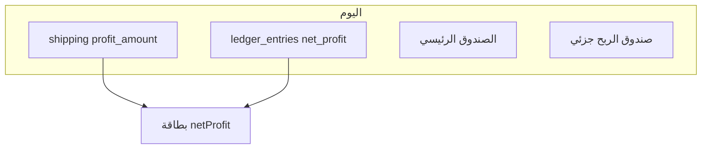

# خطة: ترحيل الأرباح لصندوق الربح، بيانات المستخدمين، وإضافات/خصومات

## السياق الحالي (مرجع)

- **بطاقة الربح الصافي** في `[routes/dashboard.js](routes/dashboard.js)`: `netProfit = shippingProfit + ledgerNetProfit` حيث `ledgerNetProfit = sumLedgerBucket(..., 'net_profit')` — انظر `[services/ledgerService.js](services/ledgerService.js)` (مع استثناء مزدوج لـ `cycle_creation_discount_profit` عند وجود `transfer_discount_profit`).
- **صندوق الربح** موجود عبر `[services/fundService.js](services/fundService.js)` (`ensureDefaultProfitFund`, `exclude_from_dashboard`)؛ حركات `agency_company_to_profit_pool` تُرحَّل من `[services/agencySyncService.js](services/agencySyncService.js)` لكن **لا** يُرحَّل تلقائياً كل `insertLedgerEntry` من نوع `net_profit`.
- **بيانات الأعضاء** موزعة: `[deferred_salary_lines](db/schema.pg.sql)`، `[payroll_user_audit_cache](db/schema.pg.sql)`، `[agency_cycle_users](db/schema.pg.sql)`، `[payroll_cycle_cache](db/schema.pg.sql)` (JSON)، و`payroll_native_userinfo_workbook` للدورات المحلية — لا يوجد جدول «ملف عضو» واحد لـ 2000 مستخدم.

---

## الجزء 1: ترحيل كل أرباح الدفتر إلى صندوق الربح + بطاقة الربح

**الهدف المحاسبي:** إبقاء **دفتر صافي الربح** مصدراً للتقارير و«مصادر الربح»، ومع **إيداع موازٍ** في **صندوق الربح** لكل قيد ربح جديد (ومعكوس آمن عند التصحيح إن وُجد لاحقاً).

**القاعدة لتجنب الازدواج في بطاقة الربح الصافي:**  
لا تُجمع **رصيد صندوق الربح** مع `ledgerNetProfit` في `netProfit` (كما في التعليق الحالي في `[routes/dashboard.js](routes/dashboard.js)`). إما:

- الإبقاء على `netProfit = shippingProfit + ledgerNetProfit` كما هو (معكوس مع الشحن)، وعرض **رصيد صندوق الربح** كسطر ثانٍ اختياري في JSON/للـ UI، **أو**
- توحيد العرض لاحقاً (قرار منتج): يتطلب إزالة الشحن من `netProfit` أو نقل شحن الربح إلى الدفتر — **يُفضَّل عدم تغيير صيغة الربح في نفس المرحلة** لتقليل المخاطر.

**التنفيذ التقني المقترح:**

1. إضافة دالة مركزية في `[services/fundService.js](services/fundService.js)` أو ملف جديد `[services/netProfitProfitFundSync.js](services/netProfitProfitFundSync.js)`:
  - `mirrorNetProfitLedgerToProfitFund(db, { userId, ledgerEntryId, amount, sourceType, cycleId, notes })`  
  - تستدعي `creditFundBalance` على `getProfitFundId`، بنوع `fund_ledger` مثل `net_profit_mirror` أو `ledger_mirror_<sourceType>`، مع `ref_table = 'ledger_entries'` و `ref_id = ledgerEntryId` لمنع التكرار (فحص وجود حركة بنفس المرجع قبل الإدراج).
2. تعديل `[insertLedgerEntry](services/ledgerService.js)` **أو** (أفضل) لمسة بعد كل `insertLedgerEntry` من نوع `bucket === 'net_profit'` و`amount > 0` في المواضع المستدعية — الأنظف: **دالة جديدة** `insertNetProfitLedgerAndMirrorFund(db, {...})` في `ledgerService` تستدعي `insertLedgerEntry` ثم المرآة.
3. تمرير جميع مسارات الربح الحالية عبر هذه الدالة تدريجياً:
  `[services/cycleAccountingService.js](services/cycleAccountingService.js)`، `[services/agencySyncService.js](services/agencySyncService.js)` (خصم التحويل)، `[routes/shipping.js](routes/shipping.js)`، `[routes/accreditations.js](routes/accreditations.js)`، `[routes/fxSpread.js](routes/fxSpread.js)` إن وُجد، إدارة إدارية، إلخ.  
   **ملاحظة:** حركة `sub_agency_company_profit` تُسجَّل في الدفتر **وتُرحَّل** أصلاً للصندوق عبر `agency_company_from_main` / `agency_company_to_profit_pool` — يجب **عدم** تكرار إيداع نفس المبلغ مرتين؛ إذا كان القيد يُراد أن يكون «مرآة فقط» للصندوق، نحدد سياسة: إما مرآة للدفتر فقط للأنواع التي لا يوجد لها حركة صندوق، أو نربط `ledger_mirror` بعد `transfer_discount_profit` فقط.
4. **تحديث واجهة المصادر/اللوحة:**
  - مصفوفة المصادر في `[public/js/profit-sources.js](public/js/profit-sources.js)` تغطي التسميات؛ يمكن إضافة بطاقة فرعية على الرئيسية تعرض قائمة بالمصدر (استدعاء `aggregateNetProfitBySource` + شحن) — إن رُغب بذلك في نفس المهمة أو مرحلة فرعية.

**مخاطر:** تكرار إيداع نفس الربح في صندوق الربح إذا كان المسار مزدوجاً (مثال: وكالات). يُحلّ بجدول `ref` فريد أو فحص `fund_ledger` لـ `ref_id = ledger_entries.id`.

---

## الجزء 2: قسم «بيانات المستخدمين» (ملف لكل عضو)

**الهدف:** جدول مركزي + واجهة لـ ~2000 مستخدم مع بحث، وملف تفصيلي يجمع معلومات من المصادر الحالية.

**مخطط قاعدة بيانات مقترح:**

- `member_profiles` (أو `payroll_member_directory`):  
`(user_id, member_user_id)` فريد، `display_name`, `last_seen_name`, `updated_at`، حقول مجمّعة: `total_salary_audited_usd` (اختياري)، `deferred_balance_usd`، `debt_to_company_usd`، `meta_json` للحقول المستقبلية.
- `member_profile_events`: سجل زمني لكل حدث (تدقيق، مؤجل، شحن، خصم/إضافة من الجزء 3) مع `type`, `amount`, `cycle_id`, `notes`, `status`.

**التعبئة (Sync):**

- عند **تدقيق دورة** أو تحديث `payroll_cycle_cache` / `payroll_user_audit_cache`: upsert للصف في `member_profiles` من أعمدة جدول الوكيل/الإدارة حسب `[routes/sheet.js](routes/sheet.js)` أو خدمة التدقيق الحالية.
- استعلامات التفصيل: JOIN مع `deferred_salary_lines`, `sub_agency_transactions` (عبر `user_agency_link`), `shipping_transactions` حيث `buyer_user_id`, و`ledger_entries` إن لزم — دون تكرار نسخ كل شيء في JSON إن أمكن.

**واجهة:**

- مسار صفحة جديد في `[routes/pages.js](routes/pages.js)` + `views/partials/member-directory.ejs` (اسم عربي: «بيانات المستخدمين»).
- قائمة: جدول مع **pagination** (مثلاً 50/صفحة)، بحث نصي على `member_user_id` واسم، نفس الثيم (`[views/dashboard.ejs](views/dashboard.ejs)` sidebar).
- صفحة تفصيل: `/member-directory/:memberUserId` أو modal — تفاصيل المجاميع + جدول أحداث من `member_profile_events` والمصادر المرتبطة.

---

## الجزء 3: نظام إضافات وخصومات ومكافآت

**الهدف:** إدخال رقم مستخدم، لصق من الحافظة، بحث تلقائي، ثم خصم / إضافة / مكافأة مع تحديث «جدول معلومات المستخدم» وسجل في الملف.

**مخطط:**

- جدول `member_adjustments`: `id`, `user_id`, `member_user_id`, `kind` (`deduct`|`add`|`reward`), `amount`, `status` (`pending`|`processing`|`done`|`failed`), `notes`, `created_at`, `cycle_id` (اختياري).
- منطق **الخصم**:
  - قراءة `current_salary` أو الرصيد من `member_profiles` / مصدر الحقيقة المتفق عليه.
  - إذا `خصم > رصيد`: تصفير الرصيد في الملف، تسجيل `debt_to_company_usd` بالفرق، حدث `member_profile_events` بنص «تم الخصم» / «دين عليه».
- **الإضافة / المكافأة:** زيادة الرصيد، بدون دين إلا إذا منطق العكس مطلوب لاحقاً.
- **واجهة:** صفحة جديدة «إضافات وخصومات» (أو اسم أقصر)، حقول RTL، نفس أزرار `[views/partials/settings.ejs](views/partials/settings.ejs)` / بطاقات.

**عند إنشاء دورة جديدة — خصم دين تلقائي من راتب الوكيل:**

- Hook في مسار إنشاء أو مزامنة الدورة (مثلاً بعد جلب صف الوكيل للمستخدم):  
إذا `debt_to_company_usd > 0` و`راتب الدورة الجديدة > 0`:  
`خصم = min(الدين، الراتب)`، تحديث الملف، تخفيض الدين، وحدث `member_profile_events` + عمود ملاحظة «تم خصم دين سابق» في السجل المعروض.
- إذا مستخدم جديد: `INSERT` في `member_profiles`؛ إذا قديم: `UPDATE` فقط.

---

## الترتيب والتسليم

| المرحلة | المحتوى                                                | ملفات رئيسية                                                                                                |
| ------- | ------------------------------------------------------ | ----------------------------------------------------------------------------------------------------------- |
| **1**   | مرآة صندوق الربح + تدقيق عدم التكرار مع حركات الوكالات | `ledgerService`, `fundService`, `cycleAccountingService`, `agencySyncService`, `shipping`, `accreditations` |
| **2**   | جداول + API + قائمة وبحث + تفصيل                       | `db/schema.pg.sql`, `database.js`, `routes/member-directory.js`, `views/partials/`*                         |
| **3**   | جدول تعديلات + واجهة + Hook الدورة                     | نفس الجداول + `routes/sheet.js` أو خدمة التدقيق                                                             |

**الاختبار:** دورة تدقيق واحدة بعد كل مرحلة؛ تحقق من `fund_balances` لصندوق الربح مقابل مجموع `ledger_entries`؛ سيناريو خصم يتجاوز الراتب.

لا يُعدّل ملف الخطة المرفق من المستخدم.