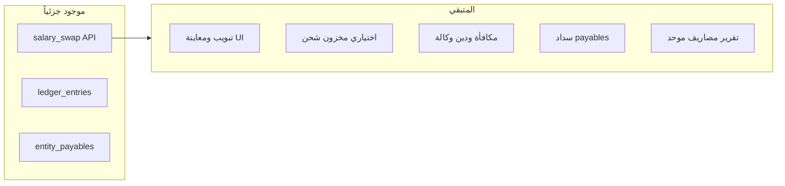

# خطة إكمال المنطق المحاسبي والواجهات المتبقية

## الوضع المرجعي

- **تبديل الراتب**: المنطق في `[routes/shipping.js](c:\Users\ALALMIA\Documents\GitHub\ERPSYSTEM-\routes\shipping.js)` (`POST /salary-swap`) يخصم نسبة كمصروف، يضيف للصندوق الرئيسي و/أو `entity_payables`، **دون** تمرير بمخزون شحن (ذهب/كرستال). الواجهة في `[views/partials/shipping.ejs](c:\Users\ALALMIA\Documents\GitHub\ERPSYSTEM-\views\partials\shipping.ejs)` ضمن تبويب «الشحن» وليس تبويباً مستقلاً؛ `[public/js/shipping.js](c:\Users\ALALMIA\Documents\GitHub\ERPSYSTEM-\public\js\shipping.js)` لا يعرض معاينة «بعد الخصم» حياً.
- **مكافأة وكالة فرعية**: `[routes/subAgencies.js](c:\Users\ALALMIA\Documents\GitHub\ERPSYSTEM-\routes\subAgencies.js)` `/:id/reward` يخصم الصندوق الرئيسي ويسجل مصروفاً؛ **لا** يوجد فرع «الوكالة مديونة لنا → المكافأة كدين على الوكالة».
- **صفحة المصاريف**: `[views/partials/expenses-page.ejs](c:\Users\ALALMIA\Documents\GitHub\ERPSYSTEM-\views\partials\expenses-page.ejs)` تسجيل يدوي فقط؛ لا قائمة مجمّعة من `ledger_entries` / `salary_swap_entries` / مكافآت.
- **اعتمادات — رفع ملف**: يوجد `bulk-balance` بملف؛ **رابط Sheet خارجي** غير مطبّق كمدخل.

---

## المرحلة 1 — تبديل الراتب (أولوية عالية)

1. **واجهة**
  - إضافة **تبويب رابع** في شريط تبويبات الشحن (`shipping-carriers` / `shipping-main` / `shipping-salary-swap` / `shipping-packages`) أو إبقاء بلوك واحد مع عنوان أوضح — القرار: **تبويب مستقل «تبديل راتب»** ينقل المحتوى الحالي من `shipping-main` إلى `tab-content` جديد مع `switchShippingTab`.
  - في `[shipping.js](c:\Users\ALALMIA\Documents\GitHub\ERPSYSTEM-\public\js\shipping.js)`: عند تغيير المبلغ/النسبة/الوضع، حساب **المبلغ بعد الخصم** وعرضه (كاش / تقسيط مع دفعة أولى / دين) كما في المواصفات؛ استدعاء `loadBalance()` بعد نجاح البيع.
2. **مسار محاسبي (قرار تصميم)**
  - **أ)** الإبقاء على المسار الحالي (صندوق مباشرة) مع **توثيق في الواجهة** أن «رصيد الشحن» في المواصفات يُمثَّل هنا بتحويل نقدي للصندوق دون كمية ذهب/كرستال.
  - **ب)** (إن طُلب صراحة): تسجيل خطوة وسيطة — مثلاً إنشاء سطر `shipping_transactions` من نوع بيع افتراضي أو حقل ربط في `salary_swap_entries` — ثم ترحيل للصندوق؛ يزيد التعقيد ويحتاج مواءمة مع `[applyBuy](c:\Users\ALALMIA\Documents\GitHub\ERPSYSTEM-\routes\shipping.js)` / المخزون.

الخطة الافتراضية للمرحلة 1: **1 + 2أ**؛ المرحلة 1ب اختيارية بعد تأكيد المستخدم.

---

## المرحلة 2 — مكافأة الوكالة الفرعية والمديونية

- في `[routes/subAgencies.js](c:\Users\ALALMIA\Documents\GitHub\ERPSYSTEM-\routes\subAgencies.js)`: بعد حساب رصيد الوكالة (المنطق الموجود في `calculateAgencyBalance` أو ما يعادله)، إذا كان **لنا مستحقات** (رصيد لصالح النظام وفق تعريفكم):
  - بدلاً من خصم كامل من الصندوق الرئيسي: تسجيل جزء أو كامل كـ `**due` / تعديل رصيد** في `sub_agency_transactions` أو ربط بدين على الوكالة؛ وإلا الإبقاء على السلوك الحالي مع خيار صريح في الواجهة «خصم من الصندوق فقط».
- تحديث `[public/js/sub-agencies.js](c:\Users\ALALMIA\Documents\GitHub\ERPSYSTEM-\public\js\sub-agencies.js)` وواجهة المكافأة لعرض الرصيد وتحذير عند المديونية.

---

## المرحلة 3 — سداد «دين علينا» عند الصرف لشركة/صندوق

- عند `[POST .../payout-from-main](c:\Users\ALALMIA\Documents\GitHub\ERPSYSTEM-\routes\transferCompanies.js)` و`[receive-from-main](c:\Users\ALALMIA\Documents\GitHub\ERPSYSTEM-\routes\funds.js)`: اختيارياً **طرح** من مجموع `entity_payables` المفتوحة لنفس الكيان (أقدم أولاً) حتى لا يزداد الدين مع كل صرف نقدي.
- يتطلب تعريف واضح: هل الصرف يُقابل **سداداً كاملاً/جزئياً** لسجلات `entity_payables`؟ تنفيذ آمن: معامل `applyToPayables: true` الافتراضي مع حد أقصى `min(amount, openPayables)`.

---

## المرحلة 4 — بطاقة/صفحة المصاريف الموحّدة

- **API**: `GET /api/expenses/ledger` أو توسيع `[routes/expenses.js](c:\Users\ALALMIA\Documents\GitHub\ERPSYSTEM-\routes\expenses.js)` لإرجاع دمج: `expense_entries` + فلتر `ledger_entries` حيث `bucket=expense` و`source_type` في (`salary_swap_discount`, `sub_agency_reward`, …) مع ترقيم صفحات اختياري.
- **واجهة**: توسيع `[expenses-page.ejs](c:\Users\ALALMIA\Documents\GitHub\ERPSYSTEM-\views\partials\expenses-page.ejs)` بجدول + فلاتر حسب المصدر؛ ربط من لوحة التحكم إن لزم.

---

## المرحلة 5 — اعتمادات: رفع برابط (اختياري)

- Endpoint جديد أو توسيع `bulk-balance`: قبول `sheetUrl` + جلب عبر تكامل Google الموجود في `[routes/sheet.js](c:\Users\ALALMIA\Documents\GitHub\ERPSYSTEM-\routes\sheet.js)` (إن كان المستخدم مربوطاً)؛ أو رفض واضح إن لم يتوفر الربط. **بديل أخف**: حقل لصق CSV نصي في الواجهة.

---

## المرحلة 6 — تقرير مصادر الربح (اختياري)

- صفحة أو قسم في لوحة التحكم يقرأ من `[ledger_entries](c:\Users\ALALMIA\Documents\GitHub\ERPSYSTEM-\services\ledgerService.js)` تجميعاً حسب `source_type` لـ `net_profit` (وما يعادله من شحن إن وُجد في جداول أخرى) — يلخص النقاط 1–8 في نص المواصفات دون تعديل `search.js`.

---

## مخاطر وترتيب

- **ازدواجية أرباح فرق التصريف**: تمت إضافة قيد `net_profit` في `[fxSpread.js](c:\Users\ALALMIA\Documents\GitHub\ERPSYSTEM-\routes\fxSpread.js)` بينما `debtAggregation` قد يحسب `fx_spread_entries` — مراجعة عرض **إجمالي الديون** مقابل **صافي الربح** قبل توسيع التقارير.
- **اختبارات**: سيناريو تبديل راتب (كاش/تقسيط/دين) + مكافأة وكالة + صرف شركة مع `applyToPayables`.

---

## ملخص الأولويات للتنفيذ

| الأولوية | الموضوع                                             |
| -------- | --------------------------------------------------- |
| P0       | تبويب + معاينة تبديل الراتب + توثيق المسار المحاسبي |
| P1       | مكافأة وكالة عند المديونية                          |
| P2       | سداد payables عند الصرف                             |
| P3       | صفحة مصاريف موحّدة                                  |
| P4       | رفع اعتمادات برابط أو لصق CSV                       |
| P5       | تقرير مصادر الربح                                   |

