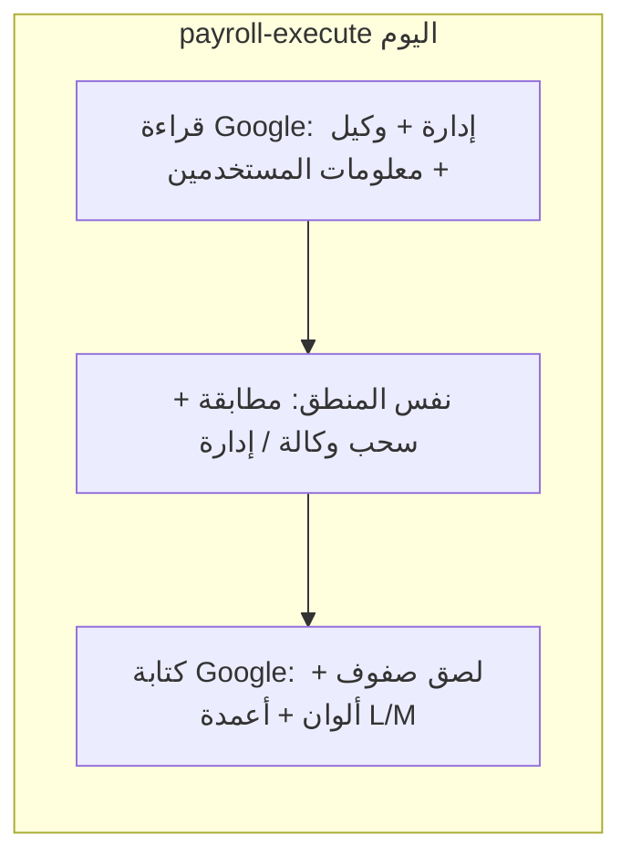
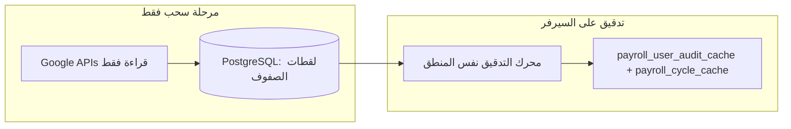

# تدقيق على السيرفر بعد سحب الجداول فقط

## الوضع الحالي

- بيانات **الإدارة والوكيل** تُخزَّن أصلاً في `[financial_cycles.management_data` / `agent_data](db/schema.pg.sql)` وتُحدَّث عند المزامنة.
- **جدول معلومات المستخدمين** (الورقة التي يُختار `spreadsheetId` لها من الواجهة) يُقرأ من Google في كل تنفيذ (`[routes/sheet.js](routes/sheet.js)` ~734–742) ولا يُخزَّن في الدورة — لذلك التدقيق «الكامل» مرتبط بقراءة إضافية من Google في كل مرة.
- [التدقيق المحلي](services/localAuditService.js) يعلّم مستخدماً واحداً من `payroll_cycle_cache` فقط؛ لا يعاد تنفيذ حلقة «تنفيذ التدقيق» على كل الصفوف.

## الهدف (المطلوب)

- **لا كتابة** على `spreadsheets.values.`* / `batchUpdate` أثناء التدقيق.
- **نفس المنطق** الحالي لأنواع النتائج (سحب وكالة / راتبين / سحب إدارة / غير موجود) والخصم من `[discountMultiplier](routes/sheet.js)`.

## تصميم تقني

### 1) استخراج «محرك التدقيق» (إعادة استخدام)

- نقل الجزء الحاسوبي (بناء `mgmtByUserId` / `agentByUserId`، حلقة `dataRows`، إنتاج `results` و`byTitle`) إلى وحدة جديدة مثلاً `[services/payrollAuditEngine.js](services/payrollAuditEngine.js)`.
- الدخل: `managementRows`, `agentRows`, `userInfoRows` (مصفوفات صفوف)، إعدادات الأعمدة (C/D/L، أعمدة الدورة)، `discountRate`، ألوان (للتخزين في التفاصيل وليس لـ Google).
- المخرجات: `results`, `byTitle`, `summary` — بنفس الشكل الذي يعتمد عليه الرد الحالي قدر الإمكان حتى لا تتكرر المنطقات.

### 2) تخزين «لقطة» جدول معلومات المستخدمين

- إضافة حقل (أو جدول فرعي) لتخزين JSON لصفوف ورقة معلومات المستخدمين بعد السحب، مثلاً:
  - `financial_cycles.user_info_data TEXT` + `user_info_sheet_name TEXT` (واختياري `user_info_spreadsheet_id` إن لزم التتبع)، **أو**
  - توسيع `[payroll_cycle_cache](db/schema.pg.sql)` بعمود `user_info_data`.
- ملف ترحيل SQL في `[db/](db/)` متوافق مع PostgreSQL المستخدم.

### 3) مسار «سحب» موحّد (قراءة فقط)

- توسيع مسار المزامنة الموجود (`[POST /api/sheet/cycles/:id/sync](routes/sheet.js)` أو ما يعادله) **أو** إضافة `POST /api/sheet/cycles/:id/sync-for-audit` يقوم بـ:
  - جلب إدارة + وكيل (كما اليوم) وحفظهما في `financial_cycles` وتحديث `payroll_cycle_cache`.
  - جلب ورقة معلومات المستخدمين (نفس `range` تقريباً `A:ZZ`) **مرة واحدة** وحفظها في `user_info_data`.
- كل ذلك **قراءة فقط**؛ يمكن إعادة استخدام `[fetchSheetWithFallback](routes/sheet.js)` و`[googleSheetsReadHelpers](services/googleSheetsReadHelpers.js)` لتخفيف 429.

### 4) مسار تنفيذ تدقيق بدون Google

- مسار جديد مثلاً `POST /api/sheet/payroll-audit-local` (أو `payroll-execute` مع `body: { mode: 'local' }`):
  - يتحقق أن `management_data`, `agent_data`, و`user_info_data` موجودة وحديثة (أو يطلب «زامن أولاً» برسالة واضحة).
  - يستدعي `payrollAuditEngine` فقط.
  - يحدّث `[saveUserAuditStatus](services/payrollSearchService.js)` و`[saveCycleCache](services/payrollSearchService.js)` بنفس أسلوب نهاية `payroll-execute` اليوم (المجموعات `auditedAgentIds` / `auditedMgmtIds`).
  - **لا** يستدعي: لصق الصفوف، `append`/`update` على أوراق الإدارة، تلوين Google، تحديث أعمدة L/M على الملف.

### 5) الواجهة

- في `[views/partials/payroll.ejs](views/partials/payroll.ejs)`: زر «مزامنة للتدقيق» (سحب) وزر «تنفيذ تدقيق محلي» (سيرفر فقط)، مع إبقاء زر التنفيذ الحالي اختيارياً كـ «تطبيق على Google» إن رغبت لاحقاً أو إخفاؤه لاحقاً لتقليل الأخطاء.

### 6) حالات خاصة

- إن كانت الدورة **بدون** `management_spreadsheet_id` / `agent_spreadsheet_id`: المسار المحلي يفشل مبكراً برسالة صريحة (بدل إنشاء ملف Google جديد كما في السطور ~872+ من `payroll-execute`).
- **الوكالات / المؤجل / الصندوق**: تبقى اختيارية في مرحلة السحب فقط (قراءة)، كما هي اليوم بعد المزامنة — لا حاجة لتشغيلها داخل «تدقيق محلي» إلا إذا أردت توحيدها في «سحب واحد».

## مخاطر / قرار منتج

| القرار                                  | خيار                                                                  |
| --------------------------------------- | --------------------------------------------------------------------- |
| هل نبقي «تطبيق على Google» كخيار ثانٍ؟  | موصى به: نعم مؤقتاً، ثم تعطيل من الواجهة إذا رضيت بالمسار المحلي فقط. |
| عرض نتائج التدقيق بدون ألوان في الجداول | يمكن عرض الملخص والنتائج في الواجهة أو تصدير CSV من السيرفر لاحقاً.   |

## ملخص الملفات المتوقعة

| ملف                                                                | عمل                                                                                                            |
| ------------------------------------------------------------------ | -------------------------------------------------------------------------------------------------------------- |
| `[services/payrollAuditEngine.js](services/payrollAuditEngine.js)` | جديد: المنطق المستخرج                                                                                          |
| `[routes/sheet.js](routes/sheet.js)`                               | تقليص `payroll-execute` لاستدعاء المحرك + مسار جديد للتدقيق المحلي؛ إزالة/تجاوز مسار الكتابة عند `mode: local` |
| `[db/schema.pg.sql](db/schema.pg.sql)` + ترحيل                     | عمود/جدول لـ `user_info_data`                                                                                  |
| `[views/partials/payroll.ejs](views/partials/payroll.ejs)` + JS    | أزرار مزامنة / تدقيق محلي                                                                                      |

هذا يحقق: **سحب من Google فقط في مرحلة المزامنة**، و**نفس منطق التدقيق** على السيرفر **دون كتابة على الجداول**، مع تقليل قوي لاستهلاك **Write requests** وضغط **Read** (قراءة مجمّعة عند السحب بدلاً من تكرارها مع كل تنفيذ).