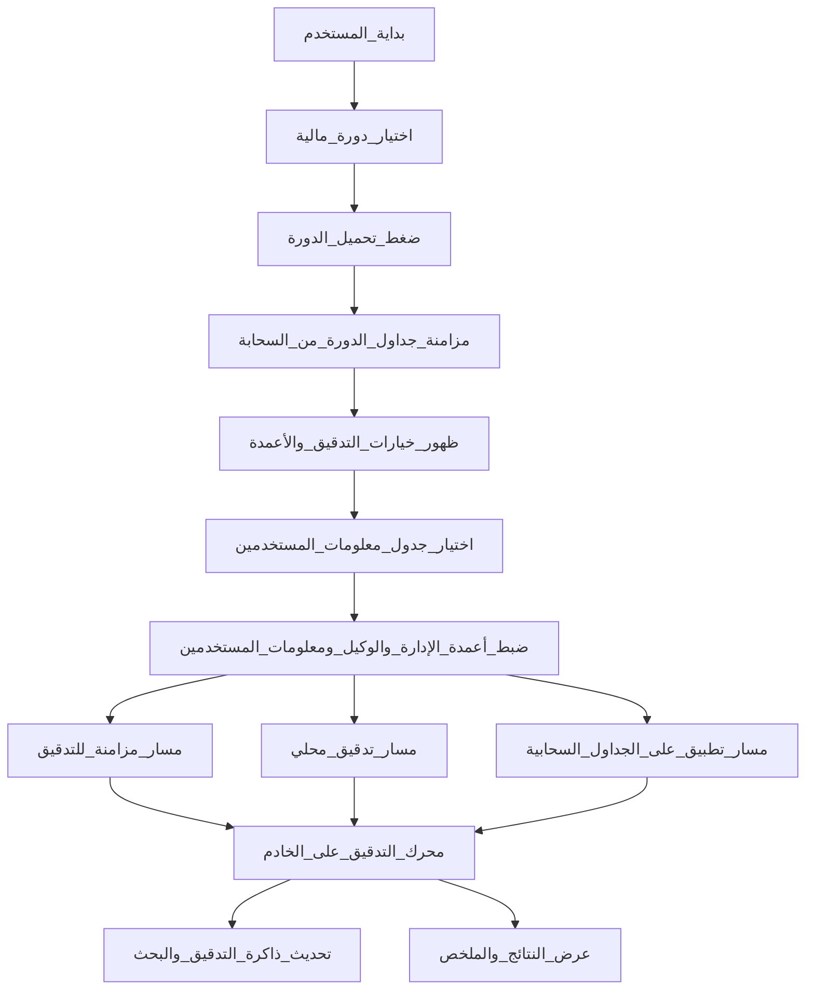

# خريطة ووصف قسم تدقيق الرواتب

## نطاق القسم

- **الصفحة في التطبيق:** عنوانها «تدقيق الرواتب»، والمسار يفتح القالب [views/partials/payroll-google.ejs](views/partials/payroll-google.ejs).
- **الفكرة:** ربط **ثلاثة مصادر بيانات** لكل دورة مالية: ورقة **إدارة** الدورة، وورقة **وكيل** الدورة، و**جدول معلومات المستخدمين** (قائمة مركزية بأرقام المستخدمين وأسماء الأوراق والرواتب). المحرك [services/payrollAuditEngine.js](services/payrollAuditEngine.js) يقرأ الصفوف ويصنّف كل مستخدم حسب وجوده في الوكيل والإدارة فيُنتج أنواعاً مثل «سحب وكالة» و«سحب إدارة» و«غير موجود»، مع تطبيق **نسبة خصم** على مجموع رواتب الوكيل عند وجود أكثر من سطر.
- **امتدادات أخرى مرتبطة:** حفظ حالة التدقيق في الذاكرة المؤقتة للبحث، وربط لاحق ب**محاسبة الدورة** عبر مسارات في [routes/cycleAccounting.js](routes/cycleAccounting.js) (تسجيل أرباح التدقيق في دفتر الأرباح، وإعادة بناء المؤجل) — هذه خطوات منفصلة عن شاشة التدقيق نفسها لكنها تكمّل «دورة حياة» التدقيق بعد التنفيذ.

---

## مخطط تدفق عام (من الواجهة إلى النتيجة)

**معنى المسارات الثلاثة:**

- **مزامنة للتدقيق:** يسحب من الجداول السحابية أحدث نسخ من جداول الإدارة والوكيل **ومن جدول معلومات المستخدمين** المختار، ويخزّنها على الخادم كي يعمل التدقيق اللاحق على بيانات محدّثة.
- **تدقيق محلي:** يشغّل المنطق **على الخادم فقط** باستخدام اللقطات المخزّنة؛ **لا يكتب** في الجداول السحابية. مناسب للمراجعة السريعة أو عند رغبة بعدم المساس بالجدول.
- **تطبيق على الجداول السحابية:** يشغّل نفس المنطق ثم **يكتب** النتائج (القيم والألوان والحالات حسب الإعدادات) في جدول معلومات المستخدمين المرتبط بالدورة.

تفاصيل المسارات البرمجية مربوطة بمسارات التطبيق تحت حزمة «واجهة الجداول» في [routes/sheet.js](routes/sheet.js) (طلبات حفظ المزامنة، التدقيق المحلي، التنفيذ الكامل مع الكتابة السحابية).

---

## أقسام الواجهة وكل خيار وزر (حسب ظهورها في القالب)

### القسم الأول: مزامنة الدورة المالية

| العنصر                   | الوظيفة                                                                                                                                                                             |
| ------------------------ | ----------------------------------------------------------------------------------------------------------------------------------------------------------------------------------- |
| قائمة **الدورة المالية** | اختيار دورة مالية مُعرّفة مسبقاً في قسم الجداول؛ إن لم توجد دورات تظهر رسالة تنبيه بأن إنشاء الدورة يكون من هناك أولاً.                                                             |
| زر **تحميل الدورة**      | بعد الاختيار: يُظهر قسم «خيارات التدقيق»، يطلب من الخادم مزامنة بيانات ورقتي الإدارة والوكيل للدورة، ويحدّث قوائم **أعمدة الدورة** (انظر أدناه) اعتماداً على بنية الأوراق المربوطة. |

### القسم الثاني: خيارات التدقيق (يظهر بعد تحميل الدورة)

| العنصر                                       | الوظيفة                                                                                                                                                                                                     |
| -------------------------------------------- | ----------------------------------------------------------------------------------------------------------------------------------------------------------------------------------------------------------- |
| قائمة **معلومات المستخدمين (جدول البيانات)** | اختيار ملف الجدول السحابي الذي يحتوي جدول معلومات المستخدمين المركزي؛ تُحمّل القائمة من حساب الجداول المربوط.                                                                                               |
| زر **مزامنة للتدقيق**                        | يرسل للخادم: معرّف الدورة، ومعرّف جدول معلومات المستخدمين، واسم الورقة إن وُجد؛ فيُحدّث مخزون الدورة على الخادم **ويُسحب** جدول المستخدمين. شرط أساسي قبل التدقيق المحلي إن لم تكن هناك لقطة محفوظة مسبقاً. |
| زر **تدقيق محلي**                            | يشغّل التدقيق باستخدام البيانات المخزّنة؛ **دون كتابة** على الجداول السحابية؛ يعرض الملخص والتشخيص في منطقة النتائج.                                                                                        |
| زر **تطبيق على الجداول السحابية**            | يشغّل التدقيق **مع الكتابة** في جدول معلومات المستخدمين (قيم الرواتب المحسوبة، الألوان، عمود الحالة إن ضُبط)، ويعرض النتائج. يتطلب اختيار الدورة وجدول المستخدمين.                                          |

**كتلة أعمدة الدورة (الإدارة والوكيل):**

- **عمود رقم المستخدم — الإدارة:** أي عمود في ورقة الإدارة يُعتبر فيه **رقم المستخدم** الفعلي للمطابقة.
- **عمود رقم المستخدم — الوكيل:** نفس المعنى لورقة الوكيل.
- **عمود الراتب — الوكيل:** العمود الذي تُقرأ منه مبالغ الرواتب لحساب «سحب وكالة» وبعد الخصم.

تُملأ القوائم تلقائياً عند التحميل من بنية الورقة؛ إن تعذّر يبقى اختيار رمز العمود من قائمة عامة.

**كتلة ورقة وأعمدة جدول معلومات المستخدمين:**

- **الورقة:** أي تبويب داخل ملف الجدول يُقرأ منه جدول المستخدمين؛ يمكن «أول ورقة» افتراضياً.
- **عمود رقم المستخدم:** عمود المعرّف المركزي للمطابقة مع الإدارة والوكيل.
- **عمود اسم الورقة:** يُستخدم كعنوان/مفتاح للصف في المنطق والعرض.
- **عمود كتابة الراتب:** العمود الذي يُكتب فيه الراتب بعد التدقيق (في مسار التطبيق السحابي).
- **عمود كتابة الحالة (محاذي):** عمود الحالة بجانب الراتب؛ خيار «تلقائي» يعني العمود التالي بعد عمود الراتب.

### القسم الثالث: إعدادات التدقيق

| العنصر                          | الوظيفة                                                                                          |
| ------------------------------- | ------------------------------------------------------------------------------------------------ |
| حقل **نسبة الخصم**              | نسبة مئوية تُطرح من مجموع ما يُقرأ من الوكيل قبل تسجيل الراتب النهائي (تُستخدم عند «سحب وكالة»). |
| **لون الوكيل** و**لون الإدارة** | ألوان تلوين صفوف الإدارة في ورقة الإدارة عند التطبيق السحابي حسب نوع السحب (وكيل مقابل إدارة).   |
| زر **حفظ الإعدادات**            | يخزّن نسبة الخصم والألوان في جدول إعدادات التدقيق للمستخدم لاستخدامها في المرات القادمة.         |

### القسم الرابع: النتائج

- يظهر بعد نجاح **تدقيق محلي** أو **تطبيق على الجداول السحابية**.
- يعرض: رسالة الحالة، ملخص أعداد «سحب وكالة» و«سحب إدارة» و«غير موجود»، وعند الحاجة **تشخيصاً** يقارن أعداد المعرفات الفريدة بين الجداول، وعينات أرقام للتحقق اليدوي، وربما رابط فتح ملف الجدول بعد التطبيق.

---

## منطق المحرك باختصار (بدون مصطلحات برمجية لاتينية)

1. يُهمل صف العناوين في جداول الدورة إن وُجد كصف غير رقمي.
2. لكل صف في **معلومات المستخدمين:** يُستخرج رقم المستخدم والعنوان.
3. يُبحث الرقم في جدول الوكيل وجدول الإدارة (حسب الأعمدة المختارة).
4. **إن وُجد في الوكيل والإدارة:** النوع «سحب وكالة»؛ وإن وُجد أكثر من سطر وكيل لنفس الرقم يُجمع الراتب ويُطبَّق الخصم ويُذكر إن كان «راتبين».
5. **إن وُجد في الإدارة فقط:** «سحب إدارة».
6. **إن لم يُطابق أحدهما بالشكل المتوقع:** «غير موجود».
7. النتائج تُحفظ للبحث والواجهات الأخرى عند التنفيذ الناجح على الخادم.

---

## رصيد المؤجل وعلاقته بالتدقيق (لماذا يبدو «الكامل» أولاً ثم «الحقيقي» لاحقاً)

### المعنى المحاسبي في النظام

- **رصيد المؤجل** في الخادم يُجمَّع من **سطور مؤجلة** تُسجَّل لكل دورة: مبالغ تُعتبر «رواتب مؤجَّلة الدفع» لمن **لم يُسجَّل تدقيقهم بعد** في تلك الدورة، ويُحسب أصلها من **جدول الوكيل** (بعد تطبيق نسبة خصم التحويل للدورة وما يُخصم من ديون إن وُجدت منطقياً).
- من يُصنَّف **مدققاً** (بعد نجاح التدقيق كسحب وكالة أو سحب إدارة) يُستبعد من احتساب المؤجل لتلك الدورة: لأن الراتب صار **مقرّاً** ضمن التدقيق وليس «معلّقاً» كمؤجل بنفس المعنى.

### التسلسل المنطقي (قبل التدقيق مقابل بعده)

1. **قبل التدقيق:** أي مستخدم له راتب في جدول الوكيل و**لم يُدقَّق بعد** يدخل ضمن احتمال المؤجل — فيبدو الإجمالي وكأنه يمثّل «مجموع رواتب الوكيل» بشكل أوسع (كل غير المدققين).
2. **بعد التدقيق:** يُحدَّث سجل التدقيق للمستخدمين المطابقين، ثم تُعاد معالجة المؤجل على الخادم بحيث **لا يبقى في المؤجل** إلا من **لم يُدقَّق** بعد. هنا يصبح الرقم أقرب لما تسمّيه «الحقيقي»: **الباقي غير المدقّق فقط**.
3. تعليق في الكود يوضّح أن المؤجل يُبنى **بعد** حفظ حالة «مدقق»؛ أي أن قراءة قديمة من الجداول السحابية **قبل** التدقيق كانت تُسجّل الجميع كمؤجل — والتدقيق يصحّح ذلك.

### هل يوجد انتظار نصف ساعة مبرمجاً؟

- **لا:** في المسار البرمجي لتدقيق محلي أو تطبيق على الجداول السحابية، تُستدعى **إعادة بناء المؤجل من بيانات الوكيل المحفوظة على الخادم** في **نفس طلب التدقيق** بعد حفظ حالات المدققين، وليس بعد مؤقّت زمني.
- إن لاحظت تأخيراً نحو **نصف ساعة** بين «عرض الرواتب كاملة» و«ظهور رصيد المؤجل المحدَّث»، فالأسباب المحتملة **تشغيلية** وليست مؤقتاً ثابتاً في المنطق:
  - **لوحة التحكم** قد تعرض إحصاءً جُلب سابقاً ولا تُحدَّث تلقائياً حتى **تحديث الصفحة** أو إعادة فتحها.
  - صفحة **رصيد المؤجل** قد تستخدم زر **تحديث** يستدعي مساراً يقرأ من **الجدول السحابي مباشرة** ويعيد كتابة السطور — فإن لم تضغط التحديث يبقى العرض السابق.
  - مقارنة ذهنية بين **مجموع الأعمدة في الجدول السحابي** (كل الرواتب الظاهرة) وبين **رقم المؤجل في النظام** (غير المدققين فقط) قد تُفسَّر كـ«تأخير» وهي في الحقيقة **اختلاف تعريف** لا تأخير تقني.

### مخطط مبسّط لرصيد المؤجل بعد التدقيق

---

## ملاحظات للمستخدم النهائي

- **الترتيب الموصى به:** تحميل الدورة → اختيار جدول المستخدمين وضبط الأعمدة → **مزامنة للتدقيق** إن احتجت أحدث بيانات → ثم إما **تدقيق محلي** للمعاينة أو **تطبيق على الجداول السحابية** للكتابة الفعلية.
- **التدقيق المحلي** لا يغيّر الجداول السحابية؛ **التطبيق** يغيّرها ويتطلب اتصالاً صالحاً بحساب الجداول.
- **محاسبة الدورة** (تسجيل أرباح التدقيق في الدفاتر أو إعادة بناء المؤجل) تتم من مسارات أخرى مذكورة أعلاه وليست كلها داخل نفس الشاشة.

---

## ما لن يُذكر في المستند النهائي للمستخدم (حسب طلبك)

- أي **حرف لاتيني** في النص التوضيحي (بما في ذلك أسماء الملفات والمسارات والرموز البرمجية)، مع الإبقاء على المعنى بصياغة عربية فقط مثل «الصفحة الخاصة بتدقيق الرواتب» و«الخادم» و«الجداول السحابية المربوطة».

إن رغبت لاحقاً بإخراج هذا المحتوى كملف مستقل داخل المشروع (مثلاً وثيقة عربية صرفة)، يمكن إنشاؤه بعد الموافقة دون إدراج حروف أجنبية في النص الظاهر للقارئ.