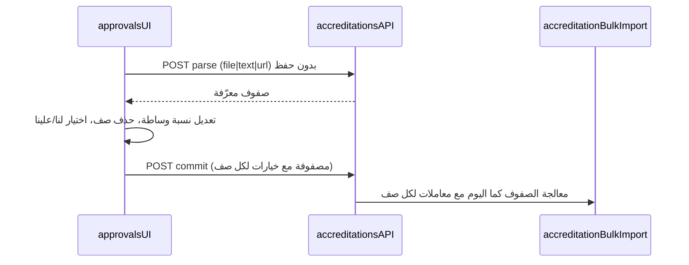

# خطة: شركات التحويل، الصناديق، الشحن، اللوحة، الاعتمادات

## السياق الحالي (مرجع سريع)

- **شركات التحويل:** `[routes/transferCompanies.js](routes/transferCompanies.js)` — قائمة، إضافة، `GET /:id` يعيد `transfer_company_ledger`، و`POST /:id/payout-from-main` (صرف من الرئيسي أو تسجيل دين علينا عبر `entity_payables`). **ملاحظة:** عند الصرف النقدي للشركة يُدرَج سطر في `transfer_company_ledger` دون تحديث `balance_amount` في `transfer_companies`، بينما يُحدَّث الرصيد في مسارات أخرى مثل `[services/returnsService.js](services/returnsService.js)` و`[routes/accreditations.js](routes/accreditations.js)` — يجب توحيد السلوك.
- **الصناديق:** `[routes/funds.js](routes/funds.js)` — `GET /:id` يعيد `fund_balances` + `fund_ledger` مع `labelAr`/`colorCategory` من `[services/accountingLabelsAr.js](services/accountingLabelsAr.js)`. دين علينا تجاه صندوق: `mode === 'payable'` في `receive-from-main` يُنشئ `entity_payables` بـ `entity_type = 'fund'`.
- **الشحن (شراء):** `[routes/shipping.js](routes/shipping.js)` `POST /buy` — `purchaseSource` حالياً `administration` | `company` (جدول `shipping_companies`)؛ دين لشركة شحن فقط عند `doubt` و`qohBefore <= 0` مع `entity_payables` لـ `shipping_company`.
- **لوحة التحكم:** `[views/partials/home.ejs](views/partials/home.ejs)` + `[public/js/app.js](public/js/app.js)` + `[routes/dashboard.js](routes/dashboard.js)` — بطاقات «إجمالي الإيرادات» و«رأس المال (مسترد)» من تجميع `shipping_transactions` (حقول `total` و`capital_amount`).
- **تقارير PDF:** `[routes/reports.js](routes/reports.js)` — يوجد `pdf/movements` و`pdf/transfer-companies` عبر `[services/pdf/htmlAccountingPdf.js](services/pdf/htmlAccountingPdf.js)` و`[services/accountingReportData.js](services/accountingReportData.js)`.
- **رفع أرصدة الاعتمادات:** `[services/accreditationBulkImport.js](services/accreditationBulkImport.js)` يُنفّذ كاملاً في طلب واحد؛ الواجهة في `[public/js/approvals.js](public/js/approvals.js)` + `[views/partials/approvals.ejs](views/partials/approvals.ejs)`.

---

## 1) شركات التحويل: «دين لنا»، سجل، تقرير

**النموذج:** تعريف واضح: **دين لنا** = المبلغ الذي للشركة تستحقه لنا (تُظهره كرصيد/أصل في ملف الشركة). يُكمّل ذلك `entity_payables` الحالي (دين علينا).

- **إضافة رصيد «دين لنا»:** مسار جديد (مثلاً `POST /api/transfer-companies/:id/add-receivable`) يزيد `transfer_companies.balance_amount` (أو عموداً مخصصاً إن رُفضت إعادة استخدام الرصيد الحالي — يُفضّل توحيد الحقل مع توثيق الإشارة) ويُسجّل في `transfer_company_ledger` مع `notes` واضحة، وربما `ref_table`/`ref_id` إن وُجدت في المخطط أو إضافتها لتتبع أفضل.
- **توحيد صرف من الرئيسي:** في `payout-from-main`، عند الإيداع النقدي للشركة، استدعاء `UPDATE transfer_companies SET balance_amount = balance_amount + …` بما يطابق المبلغ المدفوع للشركة (مثل `returnsService`).
- **واجهة الملف:** `[public/js/transfer-companies.js](public/js/transfer-companies.js)` + نافذة التفاصيل في EJS: تنسيق السجل أقرب لـ `[public/js/funds.js](public/js/funds.js)` (عناوين عربية، ألوان، «رصيد بعد» إن أمكن من السجل الزمني).
- **تنزيل تقرير:** إما توسيع `[routes/reports.js](routes/reports.js)` بـ `GET /pdf/transfer-company-ledger?id=` أو فلترة في `getTransferCompaniesReportData` / دالة جديدة في `[services/accountingReportData.js](services/accountingReportData.js)` لإرجاع حركات شركة واحدة، وربط زر من نافذة التفاصيل.

---

## 2) جميع الصناديق: سجل، تقرير، لون أحمر عند «مدينين علينا»

- **سجل:** موجود في `GET /api/funds/:id`; إضافة زر «تنزيل PDF» يستدعي مساراً جديداً `pdf/fund-ledger?fundId=` (أو `/:id`) يعيد بنية مشابهة لحركات التقرير الشامل.
- **اللون الأحمر:** في قائمة البطاقات و/أو تفاصيل الصندوق، جلب `sumOpenPayables(db, userId, 'fund', fundId)` من `[services/entityPayablesService.js](services/entityPayablesService.js)` — إن كان `> 0` عرض المبلغ أو شارة بـ `text-red-600` (أو ما يعادله في الثيم).
- **التحقق من صحة الرصيد:** مراجعة `POST /api/funds/:id/receive-from-main` في `[routes/funds.js](routes/funds.js)`: يُسجَّل `fund_ledger` للصندوق المستلم دون استدعاء `adjustFundBalance` للصندوق المستلم؛ يُفترض أن يُزامَن `fund_balances` مع المبلغ المعتمد (`creditPortion`) عبر `adjustFundBalance` أو ما يعادله حتى لا يختلف الرصيد المعروض عن السجل.

---

## 3) الصندوق الرئيسي: نصوص الحركات مع الكيان

- **الهدف:** أن يظهر في `fund_ledger.notes` (أو حقول مشتقة) نص مثل: «تم تحويل … إلى شركة X» أو «إلى صندوق Y (رقم …)».
- **التنفيذ المقترح:** دالة مساعدة مركزية (مثلاً في `[services/fundLedgerNotes.js](services/fundLedgerNotes.js)` جديدة أو داخل `[services/fundService.js](services/fundService.js)`) تُستدعى عند الإدراج أو كـ **تصحيح عند القراءة** لـ `GET /api/funds/:id` للصندوق الرئيسي فقط: يقرأ `ref_table`/`ref_id` ويحمّل اسم شركة تحويل، أو اسم صندوق + `fund_number`، ويُكمّل `notes` أو `displayNotes` للواجهة دون كسر البيانات القديمة.
- **نطاق الأنواع:** تغطية `company_payout`, `fund_allocation`, `transfer_in`/`transfer_out`, وأي نوع يُرسل لـ `adjustFundBalance` من مسارات التحويل.

---

## 4) شراء شحن: مصدر «شركة تحويل» ودين علينا

- **الواجهة:** في `[views/partials/shipping.ejs](views/partials/shipping.ejs)` إضافة خيار `purchaseSource` مثلاً `transfer_company` مع قائمة من `/api/transfer-companies/list` (موجود في `[routes/funds.js](routes/funds.js)` تحت `transfer-companies/list` — يمكن إعادة استخدامه من `[public/js/shipping.js](public/js/shipping.js)`).
- **الخادم:** في `[routes/shipping.js](routes/shipping.js)` `POST /buy`:
  - عند `paymentMethod === 'debt'` و`purchaseSource === 'transfer_company'` و`transferCompanyId` صالح: `INSERT INTO entity_payables` مع `entity_type = 'transfer_company'` و`entity_id = transferCompanyId` و`amount = lineTotal` (صفوف إضافية تُتراكم؛ التسوية لاحقاً عبر FIFO الموجود).
  - إزالة/تعديل شرط `qohBefore <= 0` الخاص بـ `shipping_company` إذا كان يُطبَّق على مسار شركة التحويل (المنطق يجب أن يطابق توقع المستخدم: دين على أي شراء بالدين من شركة تحويل).
  - الحفاظ على `shipping_companies` للمسار الحالي «شركة» (شحن) كما هو.

---

## 5) صفحة «مطلوب دفع» — مواءمة الثيم

- الملف: `[views/partials/payment-due.ejs](views/partials/payment-due.ejs)` (وأي CSS مخصص).
- **التوجه:** استبدال الهيرو ذي التدرج القوي ببطاقات بيضاء `rounded-2xl border border-slate-100 shadow-sm` ونفس نمط الأيقونات/الطباعة في `[views/partials/home.ejs](views/partials/home.ejs)` (مثلاً ألوان indigo/slate/emerald بدل التدرج الكامل إن رغبت بالتوحيد الصارم).

---

## 6) لوحة التحكم: إزالة الإيرادات ورأس المال؛ رأس المال يُفهم عبر الصندوق الرئيسي

- **واجهة:** حذف بطاقتي «إجمالي الإيرادات» و«رأس المال (مسترد)» من `[views/partials/home.ejs](views/partials/home.ejs)` وإزالة `homeOpenCapitalModal` إن لم يعد مستخدماً.
- **عميل:** تعديل `[public/js/app.js](public/js/app.js)` لعدم تعبئة `totalRevenue` / `capitalRecovered` (أو إزالة العناصر).
- **خادم:** في `[routes/dashboard.js](routes/dashboard.js)` يمكن إيقاف إرجاع `totalRevenue` و`capitalRecovered` أو تركهما للتوافق مع التقارير فقط — المهم عدم عرضهما في اللوحة.
- **المعنى المحاسبي:** بيع الشحن النقدي يُودِع بالفعل الإجمالي في الصندوق الرئيسي عبر `[creditShippingCashSale](services/fundService.js)`؛ لا حاجة لبطاقة منفصلة لاسترداد رأس المال ما دام المستخدم يعتمد على رصيد الصندوق الرئيسي. لا حاجة لترحيل إضافي مزدوج إلا إذا كان هناك تدفق محاسبي يفصل صراحةً عناصر الإيراد — والطلب يقتصر على إلغاء البطاقة والاعتماد على الصندوق الرئيسي.

---

## 7) رفع أرصدة الاعتمادات: مراجعة ثم حفظ

**تدفق مقترح:**

- **مرحلة التحليل:** مسارات جديدة (مثلاً `bulk-balance-parse` لكل من نفس المدخلات: ملف، نص، رابط) تعيد JSON `{ rows: [...] }` دون تعديل قاعدة البيانات.
- **مرحلة الحفظ:** مسار `bulk-balance-commit` يستقبل قائمة `{ code, name, amount, parentRef, brokeragePct, direction }` ويستدعي منطقاً مُستخرجاً من `processAccreditationBulkImport` مع دعم **اتجاه الرصيد** (لنا/علينا) مطابقاً لمنطق «إضافة مبلغ» اليدوي في `[routes/accreditations.js](routes/accreditations.js)` (إن وُجد `direction`/`to_us`).
- **الواجهة:** في `[public/js/approvals.js](public/js/approvals.js)` بناء جدول بعد `parse`، أزرار حذف صف، ثم «حفظ الكل».

---

## ترتيب تنفيذ مقترح

1. إصلاح تزامن رصيد الصندوق عند `receive-from-main` (أساسي للثقة).
2. نصوص حركات الصندوق الرئيسي (تأثير واضح على UX).
3. شراء الشحن من شركة تحويل + دين.
4. شركات التحويل (دين لنا + توحيد الرصيد + PDF + UI).
5. صناديق (PDF + أحمر للدين + تحقق من القائمة).
6. لوحة التحكم (إزالة البطاقات).
7. صفحة مطلوب دفع (تصميم).
8. اعتمادات رفع (مرحلتان).

---

## مخاطر / قرارات

- **إشارة `balance_amount`:** إذا كان المستخدم يخلط بين «رصيد لدى الشركة» و«دين لنا»، قد يُفضّل عموداً منفصلاً؛ يُحدَّد عند التنفيذ من خلال مراجعة الاستخدام الحالي في الواجهات والتقارير.
- **استعلامات الشحن في `dashboard`:** الاستعلام الحالي لـ `shipping_transactions` يبدو غير مُقيد بـ `user_id` — إصلاحه منفصل عن الطلب إن لم يكن مُصمَّماً للمستخدم الواحد؛ يُذكر فقط إن لمس الكود نفس الملف.

