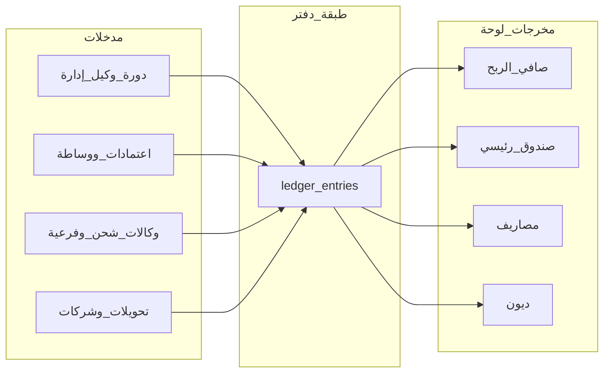

# خطة إعادة ضبط المنطق المحاسبي والوظائف الجديدة

## الوضع الحالي (ملخص تقني)

- **الدورات المالية**: `[db/schema.pg.sql](c:\Users\ALALMIA\Documents\GitHub\ERPSYSTEM-\db\schema.pg.sql)` — جدول `financial_cycles` يخزّن `management_data` / `agent_data` كـ JSON؛ لا يوجد حقل لـ «نسبة خصم التحويل» على مستوى الدورة بعد (الإعداد العام في `payroll_settings.discount_rate`).
- **الاعتمادات**: `[routes/accreditations.js](c:\Users\ALALMIA\Documents\GitHub\ERPSYSTEM-\routes\accreditations.js)` — عند `add-amount` يُخصم الوساطة ويُضاف **للصندوق الرئيسي** عبر `adjustFundBalance`، وليس لبطاقة «صافي الربح» المنفصلة كما طلبت.
- **لوحة التحكم**: `[routes/dashboard.js](c:\Users\ALALMIA\Documents\GitHub\ERPSYSTEM-\routes\dashboard.js)` — `netProfit` يُحسب من `shipping_transactions` فقط؛ `cashBalance` = مجموع أرصدة الصناديق + `cash_box_snapshot` للدورة.
- **التدقيق والأعمدة W / Y+Z**: منطق الاحتساب موجود في `[services/agencySyncService.js](c:\Users\ALALMIA\Documents\GitHub\ERPSYSTEM-\services\agencySyncService.js)` (`calculateCashBoxBalance` يجمع `sourceFirstSheetW` + `sourceYZ` في لقطة واحدة لـ `cash_box_snapshot`).
- **Google**: المزامنة والتدقيق المتقدم يعتمدان على Google Sheets في `[routes/sheet.js](c:\Users\ALALMIA\Documents\GitHub\ERPSYSTEM-\routes\sheet.js)` و`[routes/search.js](c:\Users\ALALMIA\Documents\GitHub\ERPSYSTEM-\routes\search.js)`؛ البيانات المخزّنة مسبقاً في `payroll_cycle_cache` / `financial_cycles` تسمح بتدقيق محلي **بدون** استدعاء Google في وقت التنفيذ.

## المبدأ المعماري: كل عملية = معاملة

قبل تفصيل الوحدات، يلزم **مصدر حقيقي واحد للحقيقة** لـ:

1. **صافي الربح** (بطاقة واحدة تجمع كل المصادر التي ذكرتها).
2. **رصيد الصندوق الرئيسي** (نقد فعلي متاح للتوزيع).
3. **الديون** (شركات / صناديق / تقسيط / «دين علينا»).

**الاقتراح**: إضافة جدول مركزي مثل `ledger_entries` (أو `accounting_transactions`) بحقول: `user_id`, `occurred_at`, `amount_usd`, `direction` (إضافة/خصم), `bucket` (`main_cash` | `net_profit` | `expense` | `receivable_payable` | …), `source_type` (قيمة مثل `accreditation_brokerage`, `audit_yz`, `transfer_discount`, …), `ref_table`, `ref_id`, `cycle_id`, `meta_json`.

- **تحديث** `[services/fundService.js](c:\Users\ALALMIA\Documents\GitHub\ERPSYSTEM-\services\fundService.js)`: إضافة دوال `creditProfit` / `creditExpense` تسجّل في الجدول الجديد ثم تُحدّث الإجماليات أو تُقرأ عبر `SUM` عند عرض اللوحة.
- **التوافق مع الموجود**: الإبقاء على `fund_ledger` و`accreditation_ledger` كسجل تفصيلي، مع جعل `ledger_entries` طبقة تجميع للوحة والتقارير (أو توليد `ledger_entries` من الأحداث نفسها لتجنب ازدواجية غير متسقة).

---

## 1) الاعتمادات

| المتطلب                                                             | التنفيذ المقترح                                                                                                                                                                                                                                                                                                                                                                               |
| ------------------------------------------------------------------- | --------------------------------------------------------------------------------------------------------------------------------------------------------------------------------------------------------------------------------------------------------------------------------------------------------------------------------------------------------------------------------------------- |
| أول دورة مالية → معتمد رئيسي + مبلغ جدول الوكيل                     | بعد `INSERT` في `financial_cycles` (أو endpoint لاحق): إنشاء `accreditation_entities` بعلامة `is_primary=1` (عمود جديد)، وحساب مجموع عمود الراتب من `agent_data` (نفس منطق `columnLetterToIndex` + `agent_salary_col` من `[payroll_cycle_columns](c:\Users\ALALMIA\Documents\GitHub\ERPSYSTEM-\db\schema.pg.sql)`) ثم قيد `accreditation_ledger` + ترحيل للصندوق الرئيسي حسب القاعدة الجديدة. |
| إضافة مبلغ يدوي: وساطة → صافي الربح، الباقي → الصندوق الرئيسي فوراً | تعديل `[routes/accreditations.js](c:\Users\ALALMIA\Documents\GitHub\ERPSYSTEM-\routes\accreditations.js)` `add-amount`: `brokerageAmount` → `bucket=net_profit`؛ `remainder` → `main_fund`؛ **رفض** إن لم يوجد `getMainFundId`.                                                                                                                                                               |
| رفع أرصدة (Sheet/Excel/CSV)                                         | Endpoint جديد: `POST /accreditations/bulk-balance` مع `multipart` (CSV/Excel) أو لاحقاً لصق رابط (إن وُجد تكامل). التحقق من الأعمدة A–D، ربط D بـ `accreditation_entities` (كود أو اسم)، مع `INSERT` دفعات.                                                                                                                                                                                   |
| زر «تسليم»                                                          | Endpoint: قائمة معتمدين برصيد لدورة؛ عند التنفيذ: قيود `delivery_settlement` تُصفّر `balance_amount` **بدون** `debit` من الصندوق الرئيسي (توثيق فقط).                                                                                                                                                                                                                                         |

**ملفات**: `[routes/accreditations.js](c:\Users\ALALMIA\Documents\GitHub\ERPSYSTEM-\routes\accreditations.js)`، واجهة `[public/js/approvals.js](c:\Users\ALALMIA\Documents\GitHub\ERPSYSTEM-\public\js\approvals.js)` (أو الملف المسؤول عن صفحة الاعتمادات حسب `[routes/pages.js](c:\Users\ALALMIA\Documents\GitHub\ERPSYSTEM-\routes\pages.js)`).

---

## 2) التدقيق (القسم الحالي — Google)

- **ملاحظة تنفيذية**: أي تطوير يخص «التدقيق المحلي» (القسم 5) **لا يُجرى على** مسارات أو واجهات التدقيق الحالية؛ يبقى سلوكها كما هو دون تغيير سطر واحد في ملفاتها (مثل `[routes/search.js](c:\Users\ALALMIA\Documents\GitHub\ERPSYSTEM-\routes\search.js)` ومسارات التدقيق في `[routes/sheet.js](c:\Users\ALALMIA\Documents\GitHub\ERPSYSTEM-\routes\sheet.js)` إن وُجدت).
- **عند اكتمال تدقيق دورة** (في التدفق الحالي المرتبط بـ Google):  
  - جمع **Y+Z** من صفوف جدول الإدارة (من `management_data` في الكاش أو المزامنة) → إضافة إلى **صافي الربح**.  
  - جمع **W** بالمنطق الحالي (مقسّم حسب وكالة/شركة كما في `calculateCashBoxBalance`) → إضافة إلى **صافي الربح** (وليس فقط دمجها في لقطة صندوق إن كانت تُحسب كربح).
- **نسبة خصم التحويل**: إضافة `transfer_discount_pct` على `financial_cycles` (أو جدول إعدادات للدورة). عند إنشاء الدورة أو سحب جداول الوكيل/الإدارة: تطبيق النسبة على **جميع** صفوف جدول الوكيل؛ الجزء المخصوم → **صافي الربح**؛ الراتب بعد الخصم للمستخدم غير المدقق → **رصيد مؤجل** (انظر 3).

**ملفات رئيسية** (للمنطق العام واللوحة فقط، وليس لتعديل قسم التدقيق القديم إن كان المطلوب عدم المساس به): `[services/agencySyncService.js](c:\Users\ALALMIA\Documents\GitHub\ERPSYSTEM-\services\agencySyncService.js)`، `[routes/dashboard.js](c:\Users\ALALMIA\Documents\GitHub\ERPSYSTEM-\routes\dashboard.js)`.

---

## 3) رصيد المؤجل

- تعديل عرض البطاقة/الـ API بحيث يظهر **الرصيد بعد خصم نسبة التحويل** لكل مستخدم غير مدقق (استخدام `deferred_balance_users` أو إعادة حساب من `agent_data` + نسبة الدورة).

---

## 4) الوكلات الفرعية

- عند تدقيق الدورة + مزامنة الوكالات: الإبقاء على فصل **نسبة الوكالة → صافي الربح** و**رصيد الوكالة بعد النسبة → الصندوق الرئيسي** (موجود جزئياً في `sub_agency_transactions` و`syncAgenciesFromManagementTable`؛ يُضبط ليتوافق مع `ledger_entries`).
- **زر تسليم** (نفس منطق المعتمدين): تصفير أرصدة الوكالات المختارة للدورة **بدون** خصم من الصندوق.

**ملفات**: `[routes/subAgencies.js](c:\Users\ALALMIA\Documents\GitHub\ERPSYSTEM-\routes\subAgencies.js)`، `[public/js/sub-agencies.js](c:\Users\ALALMIA\Documents\GitHub\ERPSYSTEM-\public\js\sub-agencies.js)`.

---

## 5) قسم جديد: تدقيق محلي (بدون Google — بدون تعديل التدقيق الحالي)

**الهدف**: صفحة/قسم مستقل في الواجهة يطبّق **نفس منطق التدقيق** (نتائج مطابقة للسلوك المحاسبي المطلوب) لكن يعمل **كلياً على السيرفر** من بيانات محفوظة محلياً، **دون** استدعاء Google APIs في وقت التنفيذ.

**قيد صارم (مطلوب منك)**: **لا تعديل على قسم التدقيق الموجد** — أي ملف أو مسار يخدم التدقيق الحالي (مثل `[routes/search.js](c:\Users\ALALMIA\Documents\GitHub\ERPSYSTEM-\routes\search.js)` وما يشابهه) يبقى **كما هو؛ صفر أسطر معدّلة** عليه. لا «استخراج» مشترك يتطلّب لمس تلك الملفات.

**التنفيذ المقترح**:

- **ملفات جديدة فقط** (مثال أسماء): `routes/localAudit.js`، `services/localAuditService.js`، واجهة `views/...` + `public/js/local-audit.js`، وتسجيل الراوتر في `[server.js](c:\Users\ALALMIA\Documents\GitHub\ERPSYSTEM-\server.js)` وربط من القائمة.
- **مصدر البيانات**: `payroll_cycle_cache` و/أو `financial_cycles.management_data` و`agent_data` (بعد رفع أو استيراد الدورة محلياً) — أي طلب تدقيق يقرأ JSON من DB فقط.
- **منطق المعالجة**: **نسخ/معايرة** سلوك التدقيق الحالي (أعمدة، مطابقة مستخدم، كتابة `payroll_user_audit_cache`، إلخ) **داخل الخدمة الجديدة** بالمرجعية القرائية للكود القديم دون استيراد أو تعديله؛ إن لزم تكرار دوال مثل `columnLetterToIndex` في الملف الجديد لتجنب المساس بـ `search.js`.
- **الشرط**: إذا لم تكن بيانات الدورة متوفرة محلياً، إرجاع رسالة واضحة («حمّل/زامن بيانات الدورة أولاً») بدون الاتصال بـ Google.
- **الفصل**: المستخدم يختار إما مسار التدقيق الحالي (Google) أو قسم «تدقيق محلي» الجديد؛ لا دمج واجهتين في ملف واحد قديم.

---

## 6) شركات التحويل ولوحة التحكم

- **قاعدة العرض**: التحويلات من الصندوق الرئيسي إلى شركة/صندوق = **صرف**؛ لا تُضاف أرصدة الشركات/الصناديق **الإيجابية** إلى بطاقة «رصيد الصندوق» في اللوحة؛ إذا أصبح رصيد الكيان **سالباً** من جهة نظامنا، يُعرض ضمن **إجمالي الديون** (يتوافق مع `[computeDebtBreakdown](c:\Users\ALALMIA\Documents\GitHub\ERPSYSTEM-\services\debtAggregation.js)` جزئياً لكن يُراجع تعريف `cashBalance` في `[routes/dashboard.js](c:\Users\ALALMIA\Documents\GitHub\ERPSYSTEM-\routes\dashboard.js)`).

---

## 7) الشحن — تبويب «تبديل راتب»

- واجهة جديدة (تبويب في الشحن أو صفحة فرعية): حقول الشركة، المبلغ، نسبة الخصم، نوع السداد (كاش / تقسيط / دين).
- عند «بيع»: قيود تربط **رصيد الشحن** ↔ **الصندوق الرئيسي**، وتسجيل **دين** على الشركة عند التقسيط/الدين، وأول دفعة للصندوق عند التقسيط؛ الخصم → **المصاريف** (انظر 8).

**ملفات**: `[routes/shipping.js](c:\Users\ALALMIA\Documents\GitHub\ERPSYSTEM-\routes\shipping.js)`، `[public/js/shipping.js](c:\Users\ALALMIA\Documents\GitHub\ERPSYSTEM-\public\js\shipping.js)`.

---

## 8) بطاقة المصاريف

- جدول `expense_entries` أو استخدام `ledger_entries` مع `bucket=expense` و`source_type` من: تبديل راتب، مكافأة وكالة فرعية، مصروف يدوي.

---

## 9) الزر السريع (+)

- مكوّن UI واحد: قائمتان «صادر» و«وارد» كما وصفت؛ كل خيار يفتح النموذج الموجود أو الجديد.
- **شرط الرصيد صفر/سالب**: أي صادر يعتبر **دين علينا** على الكيان المختار (تسجيل في `entity_payables` أو توسيع المنطق) — يتطلب تدفقاً موحّداً مع `ledger_entries`.

**ملفات**: `[public/js/app.js](c:\Users\ALALMIA\Documents\GitHub\ERPSYSTEM-\public\js\app.js)` والـ partials في `views/`.

---

## 10) الديون — كاش مقابل دين علينا

- عند سحب سلفة/دين: إضافة حقل `settlement_mode` (`cash` | `payable`) في الـ API المعني؛ إن `cash` → إيداع في الصندوق الرئيسي؛ الافتراضي `payable` كما طلبت.

---

## 11) وساطة إدارية (قسم جديد)

- جدول `admin_brokerage_entries`: `cycle_id`, `amount`, `pct`, `profit_part`, `main_fund_part`؛ أو صفوف في `ledger_entries`.
- واجهة: اختيار دورة (أو لاحقاً)، إدخال المبلغ والنسبة، ثم القيد كما في الاعتمادات (ربح + صندوق).

---

## 12) «دين علينا» (قسم جديد)

- عرض مجمّع من `entity_payables` + أرصدة سالبة لشركات/صناديق (كما في `debtAggregation`) مع **صفحة تفاصيل** لكل كيان تعرض `ledger`/`payables`.

---

## تدفق مبسّط (ميرميد)

---

## ترتيب التنفيذ الموصى به

1. **الأساس**: جدول `ledger_entries` (أو اسم موازٍ) + تعديل `dashboard/stats` لقراءة صافي الربح والصندوق من المصدر الجديد.
2. **الاعتمادات**: معتمد رئيسي، تصحيح `add-amount`، شرط الصندوق الرئيسي، رفع ملف، تسليم.
3. **الدورة**: حقول نسبة التحويل على الدورة + منطق المؤجل والتدقيق (Y+Z، W، خصم التحويل).
4. **الوكالات الفرعية + تسليم** + **قسم تدقيق محلي جديد** (ملفات جديدة فقط؛ التدقيق الحالي دون تغيير).
5. **لوحة التحكم وشركات التحويل** (قواعد العرض).
6. **الشحن — تبديل راتب** + **المصاريف**.
7. **الزر السريع** + **الديون (كاش/دين)** + **وساطة إدارية** + **صفحة دين علينا**.

---

## مخاطر واختبار

- **الهجرة**: إضافة أعمدة جديدة (`is_primary`, `transfer_discount_pct` على `financial_cycles`، إلخ) عبر migration في `[db/schema.pg.sql](c:\Users\ALALMIA\Documents\GitHub\ERPSYSTEM-\db\schema.pg.sql)` + سكربت ترقية للبيانات.
- **اختبار**: سيناريوهات وحدة للقيود (وساطة معتمد، تسليم بدون خصم صندوق، تدقيق يضيف Y+Z وW)، واختبار واجهة رفع CSV.

