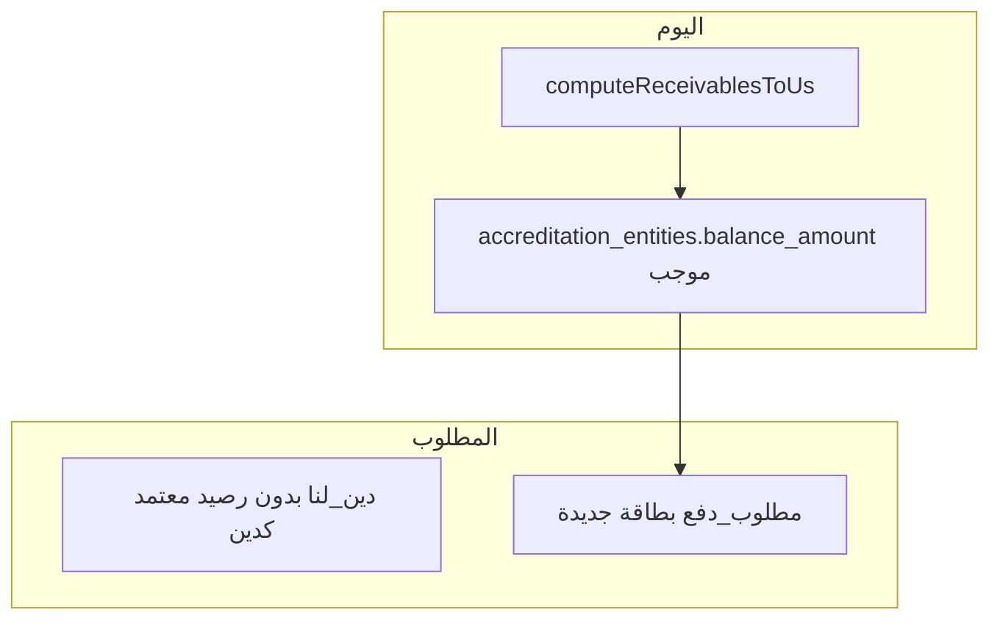

# خطة إصلاح: مطلوب دفع، وساطة إدارية، معتمدين، وكالات، زر سريع

## الوضع الحالي (مرجع)

- **الوسائط المالية**: صفحة `[/media-finance](routes/pages.js)`، جزئية `[views/partials/media-finance.ejs](views/partials/media-finance.ejs)`، API `[GET /api/expenses/media-finance-ledger](routes/expenses.js)`، رابط في `[views/dashboard.ejs](views/dashboard.ejs)`.
- **وساطة إدارية**: `[views/partials/admin-brokerage.ejs](views/partials/admin-brokerage.ejs)` + `[POST /api/admin-brokerage/add](routes/adminBrokerage.js)` يكتب في `admin_brokerage_entries` و`ledger_entries` / صندوق.
- **ديين لنا**: `[computeReceivablesToUs](services/debtAggregation.js)` يجمع حالياً: وكالات سالبة، **معتمدين برصيد موجب**، مستخدمين، مرتجعات `remain_at_entity`.
- **معتمدين**: `[POST /api/accreditations/:id/add-amount](routes/accreditations.js)` يستخدم `salaryDirection` (`to_us` / `to_them`) ويحدّث `balance_amount`؛ تسليم عبر `[POST /api/accreditations/delivery-settle](routes/accreditations.js)`.
- **وكالات فرعية**: معاملات `[sub_agency_transactions](db/schema.pg.sql)`، تسليم `[POST /api/sub-agencies/delivery-settle](routes/subAgencies.js)`، نسب دورة `[sub_agency_cycle_settings](routes/subAgencies.js)`.
- **زر سريع**: `[public/js/quick-actions.js](public/js/quick-actions.js)` + سياق `[/api/quick-action/context](routes)` (إن وُجد).

---

## المرحلة 1 — إزالة الوسائط وإثراء وساطة إدارية

| إجراء                                                                                                                                              | ملفات                                                                                                                                                                                   |
| -------------------------------------------------------------------------------------------------------------------------------------------------- | --------------------------------------------------------------------------------------------------------------------------------------------------------------------------------------- |
| حذف المسار `/media-finance`، الرابط من الشريط، تضمين الجزئية والسكربت                                                                              | `[routes/pages.js](routes/pages.js)`، `[views/dashboard.ejs](views/dashboard.ejs)`                                                                                                      |
| إزالة أو إبقاء API `media-finance-ledger` داخلياً اختيارياً؛ الأفضل إزالة المسار العام من `[routes/expenses.js](routes/expenses.js)` إن لم يُستعمل | `[routes/expenses.js](routes/expenses.js)`                                                                                                                                              |
| حذف `[views/partials/media-finance.ejs](views/partials/media-finance.ejs)`، `[public/js/media-finance.js](public/js/media-finance.js)`             | —                                                                                                                                                                                       |
| في **وساطة إدارية**: إضافة قسم «سجل حركات» يجلب قيوداً مرتبطة بـ `admin_brokerage` من `ledger_entries` + صفوف `admin_brokerage_entries`            | `[views/partials/admin-brokerage.ejs](views/partials/admin-brokerage.ejs)`، مسار جديد مثلاً `GET /api/admin-brokerage/ledger` في `[routes/adminBrokerage.js](routes/adminBrokerage.js)` |

---

## المرحلة 2 — تعريف «مطلوب دفع» وإصلاح «ديين لنا»

**قاعدة المنتج (حسب طلبك):**

- **لا** يُحتسب رصيد المعتمد الموجب كـ «دين لنا».
- يُعرض «راتب/مستحق وهمي أو مستحق دفع» في **بطاقة/قسم جديد: «مطلوب دفع»** (مجموع الالتزامات النقدية تجاه المعتمد + حصة الشركة من ربح الوكالة بعد نسبة الوكالة — حسب التعريف الذي تثبّته مع العمليات).

**تنفيذ مقترح:**

1. **جدول جديد** (مثلاً `payment_due_ledger` أو `payment_due_items`): `user_id`, `entity_type` (`accreditation`  `sub_agency`), `entity_id`, `amount_usd`, `category` (مثل `accrued_salary`, `company_share_after_agency_pct`), `cycle_id` اختياري، `meta_json`, `updated_at` — أو احتساب **مشتق** من البيانات الحالية دون جدول إذا أمكن توحيد المصدر.
2. تعديل `[computeReceivablesToUs](services/debtAggregation.js)`: **إزالة** تجميع `accreditation_entities WHERE balance_amount > 0` من «دين لنا».
3. خدمة جديدة مثلاً `computePaymentDue(db, userId)` تبني إجمالي «مطلوب دفع» من:
  - منطق الرصيد «الافتراضي» للمعتمد (قد يُشتق من `balance_amount` و`accreditation_ledger` حسب اتجاه `salaryDirection` — **يحتاج مطابقة حقل-بحقل مع واجهة الاعتمادات الحالية**)،
  - وأرباح الوكالة الفرعية «بعد خصم نسبة الوكالة للشركة» من مصدر واحد موثوق (غالباً من مزامنة الإدارة / `sub_agency_cycle_settings` كما في `[services/agencySyncService.js](services/agencySyncService.js)`).
4. صفحة أو بطاقة جديدة في لوحة التحكم أو مسار `[/receivables-to-us](routes/pages.js)` مقسّم: قسم «دين لنا» + قسم «مطلوب دفع» — أو صفحة مستقلة `/payment-due` لتفادي الاختناق.

---

## المرحلة 3 — تسليم يصفّر «مطلوب دفع»

- ربط **تسليم المعتمدين** الحالي `[delivery-settle](routes/accreditations.js)` و**تسليم الوكالات** `[delivery-settle](routes/subAgencies.js)` بمنطق موحّد: بعد التصفية، تحديث `payment_due_`* أو إعادة حساب المشتقات.
- **زر تسليم** داخل قسم «مطلوب دفع» يستدعي نفس المنطق (تصفير الحسابات المعروضة هناك).

---

## المرحلة 4 — معتمد: خيار «دين لنا» عند إضافة مبلغ

- توسيع `[POST /api/accreditations/:id/add-amount](routes/accreditations.js)` (أو واجهة الاعتمادات في `[views/partials/approvals.ejs](views/partials/approvals.ejs)` إن وُجدت) بخيار نوع: عند «دين لنا» يُسجَّل في **دين لنا** (ربما `ledger_entries` + حقل صريح أو جدول ديون) **وليس** كزيادة «مطلوب دفع».
- منطقك: «إن لم يُسلَّم المعتمد ويوجد ربح في حسابه يُخصم من حسابه» — يتطلب تعريف «ربح المعتمد» في الجدول/السجل الحالي ثم خصم ذري.

---

## المرحلة 5 — وكالة فرعية: زر «خصم» (شحن / راتب)

نطاق **كبير** ويتداخل مع `[routes/shipping.js](routes/shipping.js)`، `[services/fundService.js](services/fundService.js)`، `[entity_payables](db/schema.pg.sql)`:

- زر «خصم» في لوحة الوكالة `[public/js/sub-agencies.js](public/js/sub-agencies.js)` + `[views/partials/sub-agencies.ejs](views/partials/sub-agencies.ejs)`.
- فروع: **شحن** → فتح تدفق بيع/شراء مربوط بالوكالة (إعادة استخدام منطق الشحن مع `buyer_sub_agency_id`).
- **راتب** → فرع «تحويل» (شركة/صندوق، خصم من الصندوق الرئيسي، الباقي دين) أو «دين» فقط عند رصيد 0 أو دين قديم.
- تسجيل «ربح غير مغبوض» وربطه بسداد الدين لاحقاً يتطلب **نموذج محاسبي** (حقول في `sub_agency_transactions` أو جدول `pending_profit` مرتبط بـ `entity_payables`).

يُنفَّذ كوحدة فرعية بعد تثبيت «مطلوب دفع» و«دين لنا».

---

## المرحلة 6 — خصم تلقائي عند إنشاء دورة مالية

- بعد `INSERT` في `[routes/sheet.js](routes/sheet.js)` عند إنشاء دورة (`POST /cycles` أو المسار الفعلي)، استدعاء خدمة `onFinancialCycleCreated(userId, cycleId)`:
  - إن وُجدت مديونيات سابقة للمعتمد/الوكالة، تطبيق خصم تلقائي ثم **ترحيل الباقي** إلى «مطلوب دفع» (حسب القواعد التي تُعرّفها في المرحلة 2).

---

## المرحلة 7 — الزر السريع (+)

- توسيع قوائم «صادر / وارد» في `[public/js/quick-actions.js](public/js/quick-actions.js)`: إضافة بنود تطابق العمليات الجديدة (مثلاً: مطلوب دفع، خصم وكالة، دين معتمد) مع روابط أو نماذج مصغّرة تستدعي نفس الـ APIs.
- قد يتطلب توسيع `[/api/quick-action/context](routes)` إن وُجد.

---

## مخاطر واعتمادات

- **تعريف الرقم «الافتراضي» للراتب في ملف المعتمد** يجب أن يطابق حقول `accreditation_entities` / `accreditation_ledger` الفعلية (اتجاه `to_us` / `to_them`) لتجنب عكس الإشارات.
- **ربح الوكالة بعد نسبة الشركة** يجب أن يُستخرج من نفس مسار المزامنة الحالي وإلا تختلف الأرقام عن توقع المستخدم.
- البنود 4–6 و5 و6 تعتمد على إتمام نموذج «مطلوب دفع» في المرحلة 2–3.

---

## ترتيب تنفيذ مقترح

1. مرحلة 1 (إزالة وسائط + سجل وساطة إدارية).
2. مرحلة 2 + 3 (نموذج بيانات «مطلوب دفع»، تصحيح دين لنا، تسليم موحّد).
3. مرحلة 4 (خيار دين لنا للمعتمد).
4. مرحلة 6 (هوك الدورة) إن رغبت بالأتمتة قبل التعقيد البشري.
5. مرحلة 5 (خصم وكالة + شحن/راتب).
6. مرحلة 7 (زر سريع).

