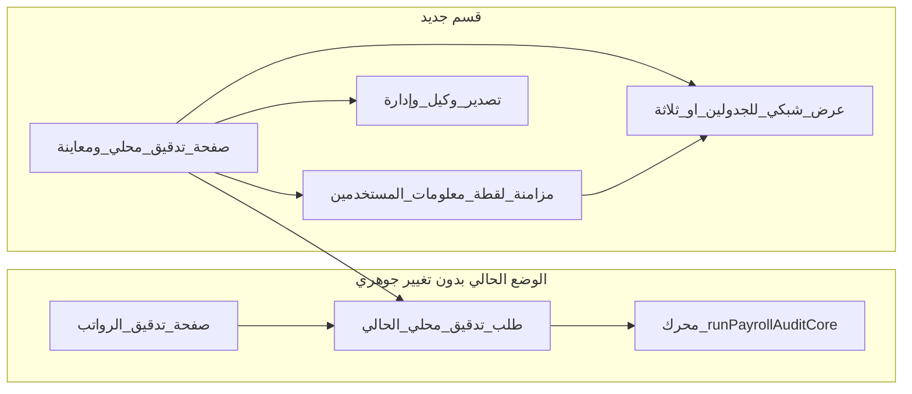

# خطة: قسم تدقيق محلي مع معاينة جداول وتصدير

## الهدف

- **قسم جديد** في التطبيق مخصّص **للتدقيق المحلي فقط** مع **معاينة بصرية** لجدولي **الإدارة** و**الوكيل** كما يظهران في جداول البيانات (شبكة أعمدة/صفوف، تمرير، تثبيت رؤوس، قراءة فقط)، و**معاينة اختيارية** لجدول **معلومات المستخدمين** من اللقطة المخزّنة عند الحاجة لمراجعة الصفوف الجديدة.
- **صفحتان منفصلتان** في التنقل: واحدة للمسار **الحالي** (مزامنة + تدقيق محلي من نفس الصفحة + تطبيق على الجداول السحابية)، وأخرى **جديدة** للمسار **المحلي المعزّز بالمعاينة والتصدير** — دون حذف أو كسر السلوك الحالي ([views/partials/payroll-google.ejs](views/partials/payroll-google.ejs) يبقى كما هو أو يُضاف له فقط رابط إلى القسم الجديد).
- **نفس منطق العمل:** استدعاء `**runPayrollAuditCore`** من [services/payrollAuditEngine.js](services/payrollAuditEngine.js) ومسار `**POST`** الحالي لتدقيق محلي [routes/sheet.js](routes/sheet.js) (`payroll-audit-local`) — يُفضّل **عدم تكرار المنطق**: إمّا إبقاء التنفيذ كما هو واستدعاؤه من الواجهة الجديدة فقط، أو استخراج دالة رفيعة في الخادم تغلّف «تحميل اللقطات + التدقيق + إعادة المؤجل» إن لزم لاحقاً دون تغيير العقد الحالي للـ API.
- **التصدير بعد الانتهاء:** تصدير **جدول الوكيل** و**جدول الإدارة** من **البيانات المخزّنة على الخادم** (`financial_cycles.agent_data` / `management_data`) إلى ملف واحد بورقتين أو ملفين (مثلاً جدول بيانات) باستخدام مكتبة `**xlsx`** الموجودة أصلاً في المشروع (مرجع: استخدام مشابه في [routes/accreditations.js](routes/accreditations.js)).

## التصميم الوظيفي

### مصدر بيانات المعاينة

- بعد اختيار **الدورة المالية** وضمان وجود **لقطة** (`management_data` / `agent_data` مملوءة)، تُعرض الصفوف كمصفوفة ثنائية الأبعاد كما تُخزَّن في قاعدة البيانات.
- **واجهة برمجية قراءة فقط** مقترحة: `GET` بمعرّف الدورة يعيد `{ managementRows, agentRows, userInfoRows, sheetNames }` من نفس الجداول — لتفادي تضخيم استجابة التدقيق نفسها (حقل `user_info_data` عند وجوده).

### إكمال التدقيق بعد إدخال أرقام مستخدمين جدد في ملف معلومات المستخدمين

- **المنطق الحالي:** محرك التدقيق يقرأ صفوف **معلومات المستخدمين** من **اللقطة المحفوظة على الخادم** (`user_info_data` في الدورة)، وليس مباشرة من الملف السحابي أثناء طلب التدقيق المحلي. لذلك أي صفوف جديدة أُضيفت في ملف الجدول السحابي **لن تُحسب** في التدقيق حتى تُحدَّث اللقطة.
- **ما تتضمنه الخطة:** على الصفحة الجديدة (أو بربط واضح بنفس مسار المزامنة الحالي):
  - زر **«مزامنة معلومات المستخدمين»** (أو **«تحديث لقطة معلومات المستخدمين»**) يستدعي نفس منطق **«مزامنة للتدقيق»** في [views/partials/payroll-google.ejs](views/partials/payroll-google.ejs): اختيار ملف الجدول وورقة معلومات المستخدمين ثم طلب المزامنة إلى الخادم — دون تغيير الـ API الحالي.
  - بعد نجاح المزامنة: إعادة تحميل المعاينة الثالثة (جدول معلومات المستخدمين) وعرض عدد الصفوف أو تنبيه إن كانت اللقطة فارغة.
  - **ثم** يضغط المستخدم **تدقيق محلي** ليُكمِل التدقيق شاملاً الأرقام الجديدة.
- **لا حاجة لتعديل `runPayrollAuditCore`** لهذه الحالة: يكفي أن تكون اللقطة محدّثة؛ المحرك يعالج كل الصفوف في `userInfoRows` كما اليوم.
- **حالة الحافة:** إذا غيّر المستخدم أعمدة معلومات المستخدمين دون مزامنة، يبقى التشخيص الحالي في الواجهة (عينات الأرقام) مفيداً؛ يُنصَح بعرض **تاريخ/حالة آخر مزامنة** في الواجهة الجديدة إن وُجدت في الخادم أو على الأقل رسالة «حدّث اللقطة قبل التدقيق» عند غياب `user_info_data`.

### شكل المعاينة «كبرنامج الجداول»

- جدولان بتبويبين أو عمودين قابل للتمرير؛ رأس صفوف/أعمدة ثابت قدر الإمكان؛ أرقام صفوف على اليمين (مناسب لاتجاه الواجهة الحالي).
- **قراءة فقط** في المرحلة الأولى؛ التلوين المطابق لنتائج التدقيق يمكن كمرحلة ثانية (ربط صف بنتيجة `userId` من استجابة التدقيق) دون تغيير المحرك.

### التصدير

- زران: **تصدير جدول الوكيل**، **تصدير جدول الإدارة**، أو زر واحد **تصدير الاثنين** (ملف واحد بورقتين).
- المحتوى من اللقطات الحالية على الخادم؛ ترميز مناسب للعربية عند الحاجة.

### التنقل «صفحتان»

- **الصفحة أ:** [routes/pages.js](routes/pages.js) — مسار جديد مثل «تدقيق الرواتب — الجداول السحابية» (العنوان الحالي للصفحة الحالية `/payroll` يُوضَّح في القائمة).
- **الصفحة ب:** مسار جديد «تدقيق محلي ومعاينة» يحمّل قالبًا جديدًا [views/partials/payroll-local-preview.ejs](views/partials/payroll-local-preview.ejs) (اسم مقترح).
- تحديث [views/dashboard.ejs](views/dashboard.ejs) أو ملف القائمة الجانبية لإظهار رابطين واضحين (بدون إزالة الرابط القديم).

## ما لا يُغيّر (التزام بعدم المساس بالمنطق الحالي)

- **لا تعديل** على `runPayrollAuditCore` إلا إن ظهرت حاجة حقيقية؛ الواجهة الجديدة تستهلك نفس المدخلات/المخرجات.
- مسار `**payroll-audit-local`** يبقى نقطة التدقيق المحلي؛ الواجهة الجديدة تستدعيه بنفس الحمولة الحالية (معرّف الدورة، الأعمدة، الألوان، نسبة الخصم).

## مخاطر وحدود

- **حجم البيانات:** دورات كبيرة قد تبطئ المتصفح؛ يمكن تقييد عرض أول /صفوف مع «تحميل المزيد» لاحقاً.
- **التزامن:** المعاينة تعرض **آخر لقطة مخزّنة**؛ يجب إبقاء زر صريح «مزامنة الدورة من الجداول السحابية» يوجّه المستخدم إما لصفحة المزامنة الحالية أو يستدعي نفس طلب المزامنة الموجود — لتجنّب التباس «معاينة قديمة». وعند إضافة مستخدمين جدد في **ملف معلومات المستخدمين** يصبح **تحديث لقطة معلومات المستخدمين** إلزامياً قبل أن يُعتبر التدقيق «مكتملاً» لكل الصفوف.

## خطوات تنفيذ مقترحة (عند الموافقة على الخروج من وضع التخطيط فقط)

1. إضافة مسار الصفحة والقالب الفارغ مع اختيار الدورة.
2. إضافة `GET` لجلب صفوف الإدارة/الوكيل للدورة.
3. بناء شبكة المعاينة (تنسيقات موجودة في المشروع أو جدول بسيط بـ Tailwind).
4. ربط أزرار التدقيق المحلي بنفس طلب الواجهة الحالية وعرض النتائج أسفل المعاينة.
5. تنفيذ التصدير عبر `xlsx` من الخادم (`GET` أو `POST` يعيد الملف).
6. دمج تدفق **مزامنة معلومات المستخدمين** (نفس الطلب الحالي) مع معاينة `user_info_data` ورسالة توجيهية قبل التدقيق بعد إضافة صفوف جدد.
7. تحديث القائمة والعناوين واختبار يدوي للدورة نموذجية (سيناريو: صفوف جديدة بعد المزامنة ثم تدقيق محلي).

