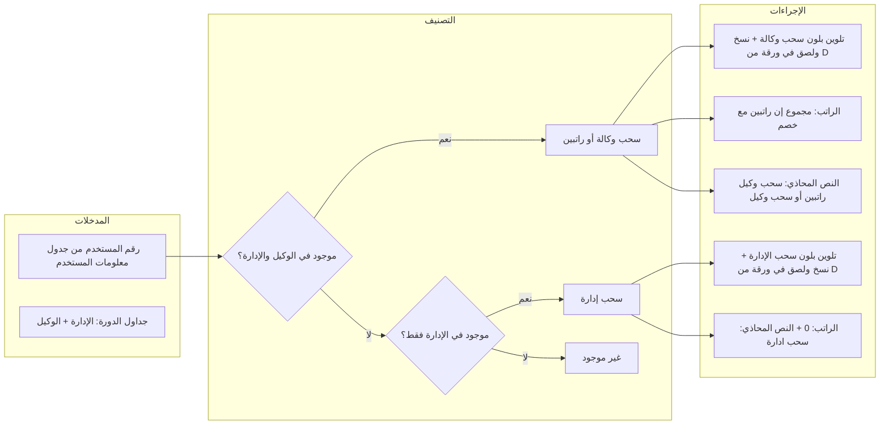

# خطة تطبيق منطق تنفيذ تدقيق الرواتب

## الوضع الحالي (ملخص)

- في [routes/sheet.js](routes/sheet.js): تحديد الحالة (سحب وكالة / سحب إدارة) والنسخ إلى ورقة في **جدول الإدارة** باسم من عمود D مطبوع بالفعل.
- كتابة الراتب: تُكتب القيمة في نطاق ثابت `L${minRow}:L${maxRow}` ولا تُطبَّق نسبة الخصم، ولا يوجد عمود محاذٍ لكتابة النص (سحب وكالة / سحب إدارة).
- نسبة الخصم مُخزَّنة في الإعدادات وفي الـ body لكن غير مستخدمة عند حساب القيمة المكتوبة.

## المنطق المطلوب (كما وصفت)

---

## 1. التأكد من التصنيف والتلوين والنسخ (موجود أو بتحسين بسيط)

- **موجود في الوكيل + الإدارة** → سحب وكالة (أو "سحب وكالة - راتبين" إذا أكثر من صف وكيل). التلوين بلون سحب الوكالة، والنسخ من جدول الإدارة ولصقه في ورقة داخل **جدول الإدارة** باسم من عمود D — **مطبق حالياً**.
- **موجود في الإدارة فقط** → سحب إدارة. التلوين بلون سحب الإدارة، والنسخ ولصق في نفس جدول الإدارة حسب اسم عمود D — **مطبق حالياً**.

لا تغيير على واجهة تدقيق الرواتب؛ التأكد فقط أن التلوين والنسخ يستخدمان نفس OAuth (حساب المستخدم) — وهو الحال لأن كل الطلبات تستخدم `config.token` من [routes/sheet.js](routes/sheet.js).

---

## 2. حساب الراتب وتطبيق نسبة الخصم

- **مصدر الراتب:** من جدول الوكيل، العمود المختار (مثلاً D) — حاليًا `cycleAgentSalaryCol` و `cycleAgentSalaryColIdx`.
- **نسبة الخصم:** من الإعدادات أو من الـ body (`discountRate` كنسبة مئوية، مثلاً 7).
  - تطبيق: الراتب النهائي = الراتب × (1 - discountRate/100). مثال: 100 و 7% → 93.
- في [routes/sheet.js](routes/sheet.js):
  - قراءة `discountRate` من الـ body أو من `payroll_settings` إن لم تُمرَّر.
  - عند حساب `salary` لكل صف:
    - **سحب وكالة (صف واحد):** راتب واحد من الوكيل بعد الخصم.
    - **سحب وكالة - راتبين:** مجموع رواتب الوكيل (قبل الخصم يُجمع ثم يُطبَّق الخصم على المجموع، أو تطبيق الخصم على كل راتب ثم الجمع — يفضل تطبيق الخصم على المجموع: مجموع الرواتب × (1 - discountRate/100)).
  - تخزين القيمة المحسوبة (بعد الخصم) في النتائج لاستخدامها في الكتابة.

---

## 3. عمود الراتب وعمود النص المحاذي في جدول معلومات المستخدمين

- **عمود الراتب (مثلاً L):** يُكتب فيه:
  - سحب وكالة: الراتب (بعد الخصم).
  - سحب وكالة - راتبين: **المجموع** (بعد خصم المجموع)، وليس نصًا مثل "10/30".
  - سحب إدارة: **0** (ولا يُترك فارغًا).
- **العمود المحاذي (مثلاً M):** يُكتب فيه النص فقط:
  - سحب وكالة → "سحب وكيل".
  - سحب وكالة - راتبين → "سحب وكيل راتبين".
  - سحب إدارة → "سحب ادارة".

تعديلات في الكود:

- استخدام العمود المختار للراتب عند الكتابة بدل الثابت: استبدال النطاق الثابت `'${mainSheetTitle}'!L${minRow}:L${maxRow}` باستخدام حرف العمود من `userInfoSalaryCol` (مثلاً `userInfoSalaryCol` من الـ body).
- إضافة دعم العمود المحاذي:
  - إما إضافة معامل اختياري من الواجهة مثل `userInfoStatusCol` (عمود كتابة الحالة)،
  - أو افتراضيًا: العمود التالي لعمود الراتب (مثلاً L → M) باستخدام `columnLetterToIndex(userInfoSalaryCol)` + 1 ثم `columnIndexToLetter`.
- التوصية: دعم معامل اختياري `userInfoStatusCol` في الـ body؛ إن لم يُمرَّر يُستخدم العمود التالي لعمود الراتب حتى لا نغيّر الواجهة إلزاميًا (يمكن لاحقًا إضافة قائمة اختيار في [views/partials/payroll.ejs](views/partials/payroll.ejs) إن رغبت).

تفاصيل التنفيذ في [routes/sheet.js](routes/sheet.js):

- بناء مصفوفتين للكتابة: واحدة لقيم الراتب (رقم أو 0)، وأخرى لنص الحالة (سحب وكيل / سحب وكيل راتبين / سحب ادارة).
- استدعاء `sheets.spreadsheets.values.update` مرتين (أو مرة واحدة بنطاقين متجاورين A:B إن أمكن) لعمود الراتب وللعمود المحاذي، مع استخدام `userInfoSalaryCol` و `userInfoStatusCol` (أو العمود التالي) وحساب النطاقات من `minRow`/`maxRow`.

---

## 4. ملاحظة "النسخ واللصق والتلوين في حساب المستخدم"

- كل استدعاءات Google Sheets (قراءة جدول معلومات المستخدمين، مزامنة الدورة، إنشاء أوراق في جدول الإدارة، اللصق، التلوين) تستخدم نفس الـ OAuth من `google_sheets_config`، أي حساب المستخدم المرتبط بالتطبيق. لا تغيير مطلوب إلا التأكد أننا لا نستخدم جدول إدارة من مصدر آخر؛ والجداول المستخدمة للنسخ/التلوين هي `cycleMgmtSsId` و `cycleAgentSsId` المرتبطان بالدورة وهي من نفس الحساب بعد المزامنة أو الإنشاء.

---

## 5. الملفات والتعديلات الموجزة

| الملف                                                    | التعديل                                                                                                                                                                                                                                                                                                                                                                                                                                         |
| -------------------------------------------------------- | ----------------------------------------------------------------------------------------------------------------------------------------------------------------------------------------------------------------------------------------------------------------------------------------------------------------------------------------------------------------------------------------------------------------------------------------------- |
| [routes/sheet.js](routes/sheet.js)                       | (1) قراءة `discountRate` وتطبيقه عند حساب `salary` (مجموع لراتبين مع خصم، أو راتب واحد مع خصم). (2) لسحب الإدارة تعيين قيمة الراتب 0. (3) استخدام عمود الراتب المختار في نطاق الكتابة (من `userInfoSalaryCol`). (4) إضافة العمود المحاذي: استقبال `userInfoStatusCol` اختياري، افتراضيًا العمود التالي لعمود الراتب؛ كتابة نصوص الحالة (سحب وكيل / سحب وكيل راتبين / سحب ادارة) في كل صف. (5) إزالة استخدام "10/30" واستبداله بمجموع بعد الخصم. |
| [views/partials/payroll.ejs](views/partials/payroll.ejs) | (اختياري) إضافة قائمة اختيار "عمود كتابة الحالة" أو "العمود المحاذي لعمود الراتب" وتمرير قيمتها في طلب التنفيذ كـ `userInfoStatusCol`؛ إن تُرك فارغًا يستخدم الـ backend العمود التالي تلقائيًا.                                                                                                                                                                                                                                                |

---

## 6. ترتيب التنفيذ المقترح

1. في `payroll-execute`: حساب قيمة الراتب (مع خصم) ومتغير النص (سحب وكيل / سحب وكيل راتبين / سحب ادارة) لكل صف في `results`.
2. تطبيق نسبة الخصم من `discountRate` (من الـ body أو من `payroll_settings`).
3. تحديد حرف عمود الحالة (من `userInfoStatusCol` أو العمود التالي لـ `userInfoSalaryCol`).
4. كتابة عمود الراتب باستخدام نطاق ديناميكي من `userInfoSalaryCol`، وكتابة عمود الحالة في العمود المحاذي.
5. (اختياري) إضافة عنصر واجهة لاختيار عمود الحالة في `payroll.ejs` وتمرير `userInfoStatusCol`.

بعد هذه التعديلات يصبح المنطق مطابقًا لوصفك: الراتب (مع خصم)، المجموع لراتبين، 0 لسحب الإدارة، والنص في العمود المحاذي، مع بقاء النسخ واللصق والتلوين في جدول الإدارة وفي حساب المستخدم.